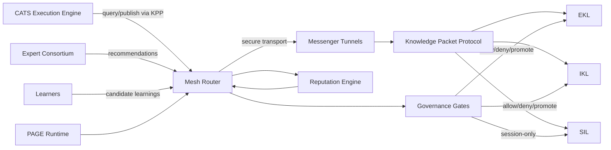

# RocketGPT Cognitive Mesh - System Overview

**Document ID:** CM-01  
**Status:** Production Architecture Specification  
**Owner:** RocketGPT Architecture  
**Last Updated:** 2026-03-06

## 1. Purpose of Cognitive Mesh

The Cognitive Mesh is RocketGPT's distributed intelligence layer responsible for secure knowledge exchange, governed learning, and cross-domain reasoning at runtime. It standardizes how knowledge is created, validated, routed, consumed, and promoted across autonomous and human-supervised components.

The mesh exists to:

- decouple intelligence generation from intelligence execution;
- enable low-latency knowledge propagation across services and agents;
- enforce governance, trust, and audit constraints on all learning flows;
- preserve explainability through evidence-linked decision artifacts.

The Cognitive Mesh is not a user-facing feature. It is a control-plane and data-plane architecture for intelligence lifecycle management.

## 2. Why RocketGPT Uses a Distributed Intelligence Mesh

RocketGPT operates in multi-tenant, high-variance environments where static monolithic intelligence is insufficient. A distributed mesh is required to support parallel experts, domain-local learning, and policy-constrained adaptation without central bottlenecks.

Primary drivers:

- domain specialization: distinct experts and learners optimize for different problem classes;
- resilience: node-level degradation does not collapse platform intelligence;
- scale: concurrent sessions can consume and produce knowledge independently;
- governance compatibility: evidence, policy checks, and promotion controls can be applied per packet and per hop;
- velocity: new learnings can propagate quickly without full system redeployments.

## 3. Key Principles

### 3.1 Distributed Intelligence

Intelligence is partitioned across specialized components (experts, learners, libraries, execution engines). No single node is assumed to be complete or globally authoritative for all tasks.

### 3.2 Knowledge Propagation

Knowledge is exchanged as structured, signed packets with explicit provenance and scope. Propagation is selective, policy-aware, and latency-bounded.

### 3.3 Governed Learning

All learning events are evaluated by governance gates before becoming reusable system knowledge. Learning can be session-local by default and only promoted when explicitly approved.

### 3.4 Zero-Trust Messaging

Every sender, packet, and tunnel interaction is authenticated and authorized. Trust is established through cryptographic identity, policy checks, and runtime verification, not network location.

### 3.5 Evidence-Driven Reputation

Reputation scores for experts, learners, and packets are computed from observed outcomes and linked evidence. Assertions without evidence cannot accumulate durable trust.

## 4. Core Subsystems

### 4.1 Knowledge Packet Protocol (KPP)

Defines canonical packet structure for cognitive exchange:

- envelope: packet ID, sender ID, tenant/session scope, timestamp, signature;
- payload: claims, recommendations, artifacts, confidence bands;
- evidence references: logs, traces, evaluation outputs, source pointers;
- governance fields: policy tags, sensitivity level, retention class, promotion eligibility.

Responsibilities:

- serialization and schema evolution;
- integrity and provenance guarantees;
- replay-safe identifiers and idempotency.

### 4.2 Messenger Tunnels

Secure transport channels between mesh participants. Tunnels provide encrypted, authenticated message delivery with backpressure and delivery telemetry.

Responsibilities:

- mTLS or equivalent authenticated transport;
- ordered or causal delivery semantics per route class;
- retry, dead-letter, and timeout handling;
- tunnel-level observability.

### 4.3 Mesh Router

Policy-aware routing fabric that decides packet destinations and priority based on intent, context, trust posture, and SLA class.

Responsibilities:

- topic and capability-based routing;
- tenant/session isolation enforcement;
- adaptive fan-out/fan-in;
- load-aware and failure-aware path selection.

### 4.4 Knowledge Libraries (EKL / IKL / SIL)

Structured knowledge stores with distinct trust and lifecycle boundaries:

- **EKL (External Knowledge Library):** validated external references, standards, and imported domain intelligence.
- **IKL (Internal Knowledge Library):** organization-specific operational and experiential knowledge.
- **SIL (Signal Intelligence Layer):** short-lived intelligence signals used for routing hints, emerging observations, and transient reasoning artifacts.

Responsibilities:

- scoped retrieval and retention policies;
- versioning and provenance indexing;
- controlled promotion paths (SIL -> IKL/EKL).

### 4.5 Learners

Runtime and batch learning components that convert outcomes into candidate improvements (prompts, strategies, heuristics, plans, routing preferences).

Responsibilities:

- extract signals from execution telemetry and outcomes;
- generate candidate deltas with confidence estimates;
- emit promotion requests with evidence bundles;
- preserve session isolation unless promoted.

### 4.6 CATS Execution Engine

Primary execution runtime that consumes mesh knowledge for task planning and action selection. CATS acts as both consumer and producer within the mesh.

Responsibilities:

- query mesh for task-relevant knowledge;
- execute plans under governance constraints;
- publish outcomes and feedback packets for learners and reputation.

### 4.7 Expert Consortium

Federated set of expert agents/services providing domain-specialized reasoning and recommendations.

Responsibilities:

- adjudicate competing hypotheses;
- return evidence-attached recommendations;
- participate in consensus and conflict resolution workflows.

### 4.8 Reputation Engine

Computes evidence-driven Learner Ratings and aggregated Learner Reputation profiles, plus reputation signals for experts and knowledge artifacts, using observed effectiveness and governance compliance.

Responsibilities:

- maintain evidence-linked scoring models;
- update confidence priors for routing and selection;
- penalize low-quality or non-compliant contributions;
- surface explainable reputation traces for audits.

## 5. Cognitive Mesh Architecture Diagram

## 6. Relationship with CATS, Governance, and PAGE

### CATS Integration

CATS is the execution substrate that operationalizes mesh intelligence. It requests guidance from the mesh, executes bounded plans, and returns outcome evidence. The mesh improves CATS quality over time while CATS provides continuous feedback signals to the mesh.

### Governance Integration

Governance gates are authoritative controls over learning acceptance, policy compliance, retention, and promotion. The Cognitive Mesh must integrate governance through hooks and must not bypass existing gate behavior.

### PAGE Integration

PAGE consumes mesh outputs for presentation, interaction orchestration, and user-facing explainability artifacts. PAGE does not replace mesh governance; it surfaces governed intelligence to end-user experiences.

## 7. Design Goals

### 7.1 Millisecond Knowledge Propagation

The mesh targets low-latency packet distribution for high-value updates, with bounded queuing, route prioritization, and fast-path cache utilization where applicable.

### 7.2 Governed Learning

Learning is continuous but never unrestricted. Every reusable improvement requires policy evaluation, evidence linkage, and scope-aware promotion controls.

### 7.3 Self-Evolving Intelligence

The mesh enables iterative improvement from real outcomes through closed feedback loops among CATS, Learners, Experts, and Reputation Engine.

### 7.4 Auditability

Every significant decision path, promotion event, and trust update is traceable to packet lineage, evidence, and policy outcomes.

---

## Non-Functional Expectations

- response shell or first stream chunk within platform latency SLOs;
- strong tenant/session isolation for improvise intelligence by default;
- transparent metrics across propagation, learning, fallback, and timeout paths;
- deterministic replay support for governance and incident audits.

## Glossary

- **SIL - Signal Intelligence Layer**  
  Short-lived intelligence signals used for routing hints, emerging observations, and transient reasoning artifacts. Signals may later be promoted to IKL.
- **Learner Rating**  
  External outcome-driven score used for reputation.
- **Learner Reputation**  
  Aggregated historical Learner Rating profile.

