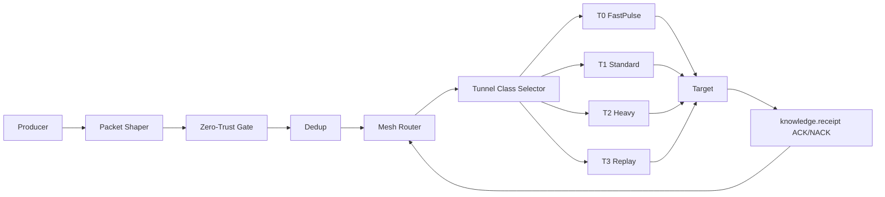
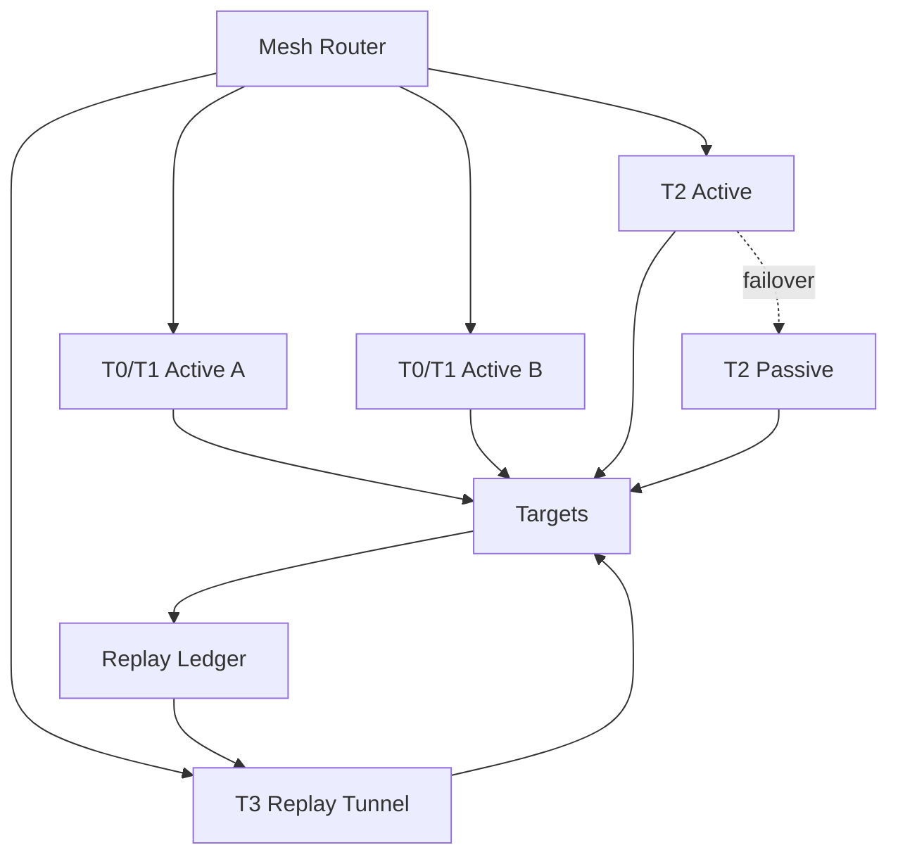
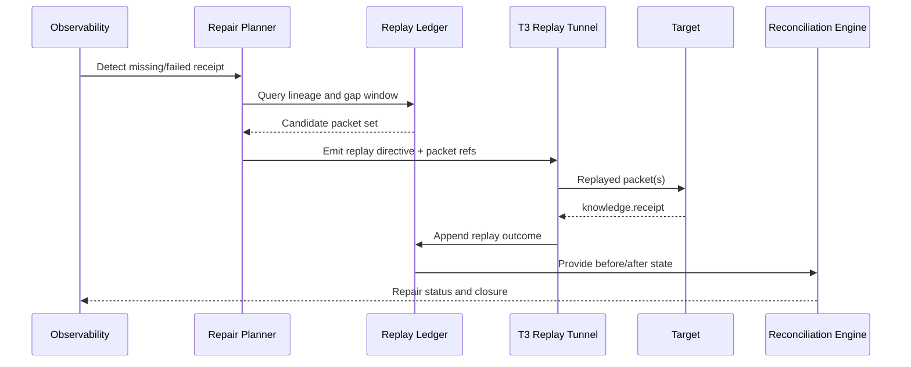

# Messenger Tunnel Architecture

**Document ID:** CM-03  
**Status:** Production Architecture Specification  
**Owner:** RocketGPT Architecture  
**Last Updated:** 2026-03-06

## 1. Concept of Messenger Tunnels

Messenger Tunnels are the secure transport fabric for Knowledge Packet Protocol (KPP) traffic inside the RocketGPT Cognitive Mesh. A tunnel is a policy-bound, encrypted delivery channel with deterministic handling rules for latency, durability, ordering, and replay behavior.

Messenger Tunnels provide:

- authenticated point-to-point and fan-out delivery;
- class-based QoS and SLA enforcement;
- loss-aware acknowledgement and retry controls;
- lineage-preserving replay and repair capability.

## 2. Tunnel Classes

### 2.1 T0 FastPulse

Ultra-low-latency channel for high-priority, small packets.

- intended traffic: `knowledge.signal`, critical `knowledge.directive`
- packet profile: compact, no large attachments
- delivery mode: low queue depth, aggressive expiry
- target outcome: minimal propagation delay

### 2.2 T1 Standard

Default balanced tunnel for most packet flows.

- intended traffic: general `knowledge.bundle`, `knowledge.receipt`
- packet profile: moderate size, normal processing
- delivery mode: durable queue with bounded retries
- target outcome: stable throughput with low error rate

### 2.3 T2 Heavy

High-capacity tunnel for larger, compute-linked packets.

- intended traffic: large `knowledge.bundle`, `knowledge.delta`
- packet profile: bigger payloads or attachment references
- delivery mode: stronger backpressure and staged dispatch
- target outcome: reliability under load

### 2.4 T3 Replay

Specialized tunnel for recovery, audit replay, and deterministic reprocessing.

- intended traffic: replayed packets, repair directives, historical receipts
- packet profile: lineage-rich packets with replay markers
- delivery mode: ordered, checkpointed, replay-safe
- target outcome: correctness and traceability over raw speed

## 3. Tunnel Pipeline

Canonical flow:

`producer -> packet shaper -> Zero-Trust gate -> dedup -> router -> tunnel -> target`

Stage responsibilities:

- `producer`: emits KPP packet with signature and scope.
- `packet shaper`: enforces class limits, canonical metadata, and priority mapping.
- `Zero-Trust gate`: verifies identity, signature, scope, and policy preconditions.
- `dedup`: drops duplicates using packet ID + nonce + time window.
- `router`: selects destination(s), tunnel class, and failover path.
- `tunnel`: executes class-specific delivery semantics.
- `target`: validates again, processes packet, emits receipt.

## 4. Tunnel Redundancy Models

### 4.1 Active-Active

Two or more live tunnel instances carry traffic simultaneously.

- benefits: low failover latency, load sharing
- requirements: strict dedup and idempotent targets
- recommended for: T0 and T1 critical paths

### 4.2 Active-Passive

Primary tunnel handles traffic; secondary remains warm standby.

- benefits: operational simplicity, predictable ordering
- tradeoff: higher failover switch time
- recommended for: lower-churn or sensitive ordered streams

### 4.3 Replay Tunnel

Dedicated redundancy path using T3 for missed, quarantined, or corrected traffic.

- benefits: deterministic repair without disrupting live channels
- requirements: checkpoint ledger and replay authorization
- recommended for: governance/audit-sensitive flows

## 5. Failure Recovery

Failure handling sequence:

1. detect: timeout, NACK, queue stall, integrity failure, or policy rejection.
2. classify: transient transport, persistent endpoint, malformed packet, or unauthorized sender.
3. recover:
   - transient: bounded retry with exponential backoff;
   - endpoint failure: failover to alternate active/passive path;
   - malformed or unauthorized: quarantine and emit reject receipt;
   - suspected loss: enqueue replay candidate in T3.
4. reconcile: compare receipts to expected delivery set.
5. close: emit final status event for observability and governance audit.

## 6. SLA Classes

SLA is enforced by tunnel class and priority policy.

- `SLA-P0` (critical control): target p95 delivery <= 20 ms, very low loss tolerance.
- `SLA-P1` (interactive intelligence): target p95 delivery <= 50 ms.
- `SLA-P2` (standard background): target p95 delivery <= 200 ms.
- `SLA-P3` (replay/audit): latency-tolerant, correctness-first.

SLA conformance is measured end-to-end from accepted producer ingress to target acknowledgement.

## 7. Observability Metrics

Required tunnel metrics:

- `tunnel_ingress_rate`
- `tunnel_egress_rate`
- `tunnel_queue_depth`
- `tunnel_delivery_latency_ms` (p50/p95/p99)
- `tunnel_ack_latency_ms`
- `tunnel_drop_rate`
- `tunnel_retry_rate`
- `tunnel_failover_count`
- `tunnel_dedup_drop_count`
- `tunnel_quarantine_count`
- `tunnel_replay_backlog`
- `tunnel_replay_success_rate`

Metrics must be broken down by tunnel class (`T0`-`T3`), tenant, and packet family.

## 8. Packet Acknowledgement System

Every accepted packet requires an acknowledgement flow based on delivery policy:

- `ACK_ACCEPTED`: packet validated and queued by target.
- `ACK_PROCESSED`: packet handler completed successfully.
- `ACK_REJECTED`: validation or policy failure with reason code.
- `ACK_DEFERRED`: accepted but delayed due to dependency/backpressure.

Acknowledgement rules:

- acknowledgements are emitted as `knowledge.receipt` packets;
- receipt must include original `packet_id`, disposition, timestamp, and signer;
- missing acknowledgement beyond class timeout triggers retry or replay path;
- duplicate acknowledgements are tolerated but correlated by receipt ID.

## 9. Replay and Repair System

Replay and repair provide deterministic correction for dropped, late, or invalid processing outcomes.

Core components:

- replay ledger: immutable record of packet lineage, receipts, and checkpoints;
- repair planner: identifies gaps between expected and observed state;
- replay executor (T3): reissues packets with replay markers and bounded scope;
- reconciliation engine: verifies repaired outcomes and closes incidents.

Replay rules:

- only authorized actors can initiate replay directives;
- replay packets must carry `replay_of_packet_id` and `replay_reason`;
- replay cannot bypass Zero-Trust gate or governance checks;
- repaired packets produce new receipts linked to prior failed attempts.

## Architecture Diagrams

### A. End-to-End Tunnel Pipeline

### B. Redundancy and Recovery Topology

### C. Replay and Repair Loop

## Related Specifications

- [CM-06 Deduplication and Redundancy Architecture](./CM-06-deduplication-redundancy.md)
- [CM-15 Knowledge Packet Ledger](./CM-15-knowledge-packet-ledger.md)

## Zero-Trust Compatibility Statement

Messenger Tunnels are Zero-Trust by default. Each stage enforces independent verification of identity, signature, tenant/session authorization, and policy compliance. No packet may transit or replay without passing Zero-Trust gate validation and subsequent target-side revalidation.

