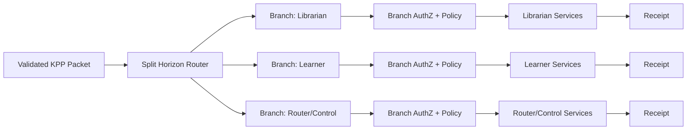

# Dual Delivery Routing

**Document ID:** CM-04  
**Status:** Production Architecture Specification  
**Owner:** RocketGPT Architecture  
**Last Updated:** 2026-03-06

## 1. Why Dual Delivery Is Required

Cognitive Mesh packets often need concurrent handling by different subsystem roles to satisfy latency, learning, and governance goals in the same execution window. Single-path delivery introduces avoidable delays and can force unnecessary sequencing between consumers that are logically independent.

Dual delivery is required to:

- support parallel intelligence consumption and learning extraction;
- prevent critical-path blocking when one consumer is non-critical;
- preserve evidence consistency across operational and learning planes;
- reduce total time-to-utility for newly produced knowledge.

## 2. Split Horizon Routing

Split horizon routing is the policy-driven branching of a single validated packet into multiple destination horizons, each with independent delivery semantics and authorization checks.

Horizons:

- **Operational horizon:** low-latency consumers (for immediate execution impact).
- **Learning horizon:** analysis/optimization consumers (for future improvements).
- **Control horizon:** governance/router/control components (for enforcement and orchestration).

Routing rules:

- branch creation occurs only after ingress validation;
- each branch receives the same logical packet identity with branch-specific metadata;
- branch SLA, retry, and receipt behavior are independently configured;
- failure in one branch does not automatically fail all branches unless policy requires all-ack.

## 3. Librarian vs Learner Delivery

### Librarian Delivery

Librarian targets (EKL/IKL/SIL-facing services) prioritize indexing, retention policy, provenance, and retrieval readiness.

- objective: durable knowledge placement;
- typical packets: `knowledge.bundle`, curated `knowledge.delta`;
- priority: consistency and lineage correctness.

### Learner Delivery

Learner targets prioritize signal extraction, pattern detection, and candidate improvement generation.

- objective: adaptive intelligence;
- typical packets: `knowledge.signal`, outcome-linked `knowledge.bundle`;
- priority: rapid feature extraction and feedback loop throughput.

Dual delivery to librarian and learner ensures immediate archival/retrieval value and parallel adaptation value from the same event.

## 4. Routing Patterns

### 4.1 Librarian + Learner

Packet is branched to both storage/indexing and adaptive learning consumers.

- use when packet has reusable evidence and optimization potential;
- common for high-quality `knowledge.bundle` and post-execution outcomes.

### 4.2 Librarian + Router

Packet is delivered to librarian for persistence and router/control for immediate distribution decisions.

- use when packet influences routing priors or policy posture;
- common for trust/reputation updates and directives requiring durability.

### 4.3 Learner + Router

Packet is delivered to learner for model/strategy adaptation and router for near-term traffic shaping.

- use when packet is high-signal but not yet archival-grade;
- common for drift signals, fallback spikes, latency anomalies.

### 4.4 Triple Delivery

Packet is branched concurrently to librarian, learner, and router/control.

- use for high-impact packets with immediate, adaptive, and durable value;
- requires stricter branch authorization and all-branch observability.

## 5. Branch Authorization Under Zero-Trust

Each branch is independently authorized even when originating from the same packet.

Authorization requirements:

- branch target must validate sender identity and signature;
- branch policy must verify tenant/session scope compatibility;
- branch purpose binding must match packet family and governance tags;
- least-privilege routing: unauthorized branches are dropped, not downgraded;
- branch decisions must emit audit events with reason codes.

Zero-Trust rule: packet validity at ingress does not imply branch-level entitlement.

## 6. Performance Considerations

Dual/triple delivery must preserve bounded latency for operational paths.

Performance controls:

- prioritize operational branch on low-latency tunnel class (for example T0/T1);
- dispatch non-critical branches asynchronously to avoid head-of-line blocking;
- use shared packet body with branch metadata overlays to minimize copy cost;
- enforce per-branch queue budgets and backpressure;
- use branch-specific acknowledgement timeouts and retry policies;
- collapse duplicate branch work via dedup keys when targets overlap functionally.

Recommended behavior:

- soft-fail non-critical branches when policy allows;
- require all-branch success only for explicitly marked governance-critical packets.

## 7. Example Routing Scenarios

### Scenario A: Execution Outcome Packet

- packet family: `knowledge.bundle`
- routing pattern: librarian + learner
- reason: store evidence-rich result while extracting improvement candidates in parallel.

### Scenario B: Routing Drift Alert

- packet family: `knowledge.signal`
- routing pattern: learner + router
- reason: adapt future decisions and adjust routing priors immediately.

### Scenario C: Promotion Directive

- packet family: `knowledge.directive`
- routing pattern: librarian + router
- reason: durable governance record plus immediate enforcement.

### Scenario D: High-Value Incident Bundle

- packet family: `knowledge.bundle`
- routing pattern: triple delivery
- reason: immediate control action, learner adaptation, and archival traceability together.

## Architecture Diagram

## Compliance Notes

- All branches must preserve packet lineage identifiers.
- Branch receipts must map to original `packet_id` plus `branch_id`.
- Unauthorized branches must be rejected with auditable disposition.

## Related Specifications

- [CM-07 Mesh Router](./CM-07-mesh-router.md)

