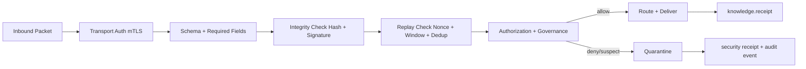

# Zero-Trust Messaging Architecture

**Document ID:** CM-05  
**Status:** Production Architecture Specification  
**Owner:** RocketGPT Architecture  
**Last Updated:** 2026-03-06

## 1. Zero-Trust Principles

RocketGPT Cognitive Mesh messaging follows Zero-Trust by default:

- never trust based on network location;
- always verify identity, integrity, and authorization per message;
- enforce least privilege for every route and branch;
- assume breach and contain by scope, policy, and rapid revocation;
- log every security-relevant decision for audit and replay analysis.

## 2. Identity Verification

Every mesh participant (service, agent, gateway, tunnel endpoint) must have a verifiable cryptographic identity.

Identity requirements:

- unique workload identity with stable principal ID;
- signed identity credential issued by trusted mesh CA/issuer;
- key rotation support with versioned key IDs;
- tenant and role binding in identity claims;
- revocation status check before packet acceptance.

## 3. Authentication Methods

Supported authentication methods:

- mutual TLS (mTLS) for transport-level peer authentication;
- per-packet digital signatures (for example Ed25519/ECDSA) for message-level authenticity;
- short-lived workload tokens (OIDC/JWT or equivalent) for control-plane actions;
- certificate pinning and trust-chain validation at ingress.

Rules:

- transport authentication is mandatory but not sufficient;
- packet signature validation is mandatory at ingress and target;
- expired or revoked credentials cause hard reject.

## 4. Authorization Rules

Authorization is evaluated for each packet and each delivery branch.

Core rules:

- authorize by principal, packet family, action, and destination capability;
- enforce tenant/session scope matching;
- enforce governance tags and data-classification constraints;
- deny by default when policy is missing or ambiguous;
- apply least-privilege permissions with explicit allowlists;
- branch-level authorization is required even for previously validated packets.

## 5. Packet Validation Pipeline

Canonical validation pipeline:

1. transport auth check (mTLS/session trust)
2. schema and required-field validation
3. timestamp/TTL/expiry validation
4. signature and key validation
5. nonce/idempotency/replay-window check
6. tenant/session scope check
7. authorization policy evaluation
8. governance policy gates
9. route admission or quarantine decision

Any failed stage results in reject or quarantine based on policy.

## 6. Quarantine System

Quarantine isolates suspicious or non-compliant packets from operational flows.

Quarantine triggers:

- signature mismatch or unknown key ID;
- policy violations or unauthorized branch attempts;
- malformed schema or inconsistent lineage;
- replay suspicion or nonce collision;
- anomalous sender behavior above threshold.

Quarantine behavior:

- move packet to isolated queue/storage;
- emit security receipt with reason code;
- block downstream delivery until adjudication;
- support manual or automated release/deny workflow;
- retain artifacts per security retention policy.

## 7. Message Integrity Validation

Integrity controls ensure packet content cannot be modified undetected.

Requirements:

- canonical serialization before hash/sign operations;
- payload hash verification on every ingress and target hop;
- signature verification against trusted key material;
- immutable lineage fields (`packet_id`, `parent_packet_id`, trace IDs);
- tamper-evident audit records for validation outcomes.

Integrity failures are security events and must be logged at high severity.

## 8. Replay Protection

Replay defense is mandatory for all packet families.

Replay controls:

- globally unique packet IDs and sender-scoped nonces;
- strict validity windows using `created_at` and `expires_at`;
- dedup cache keyed by `(packet_id, sender_id, nonce)`;
- monotonic sequence checks where ordered streams are required;
- challenge-response or token binding for sensitive directives.

Suspected replay packets are rejected or quarantined based on policy criticality.

## 9. Auditability Requirements

Zero-Trust messaging must be fully auditable end-to-end.

Audit requirements:

- log every authentication, authorization, and validation decision;
- include reason codes, policy IDs, actor IDs, and timestamps;
- preserve packet lineage and branch-level outcomes;
- record quarantine intake, adjudication, and release/deny events;
- retain acknowledgements/receipts linked to original packet IDs;
- support deterministic replay for incident investigation;
- enforce immutable, access-controlled audit storage.

## Architecture Diagram

## Enforcement Statement

No packet may be routed, replayed, or promoted inside the Cognitive Mesh without passing Zero-Trust validation and branch-level authorization.

