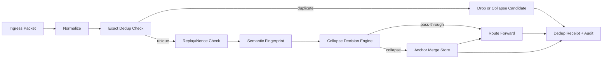

# Deduplication and Redundancy Architecture

**Document ID:** CM-06  
**Status:** Production Architecture Specification  
**Owner:** RocketGPT Architecture  
**Last Updated:** 2026-03-06

## 1. Exact Packet Deduplication

Exact deduplication removes byte-equivalent or identity-equivalent duplicates before downstream processing.

Primary exact keys:

- `packet_id`
- `sender.id`
- `integrity.payload_hash`
- `integrity.nonce`

Rules:

- if `packet_id` is already finalized, reject as duplicate;
- if `payload_hash + sender.id + nonce` matches active window, mark duplicate candidate;
- exact duplicates generate receipt with disposition `duplicate_dropped`;
- exact dedup is mandatory on ingress and before branch fan-out.

## 2. Semantic Deduplication

Semantic deduplication suppresses near-duplicate packets that differ syntactically but represent the same knowledge intent and effect.

Semantic fingerprint inputs:

- normalized packet family and routing topic;
- canonicalized claim/action set;
- scoped context (tenant, session, task);
- evidence reference signature set;
- time-bounded confidence profile.

Rules:

- semantic match thresholds are family-specific;
- only eligible families (`knowledge.signal`, selected `knowledge.bundle`) can collapse semantically;
- governance-critical directives are excluded unless explicitly allowed.

## 3. Temporal Collapse Window

Temporal collapse window defines the interval where equivalent events are collapsed into a single retained packet with merged metadata.

Window policy:

- T0/T1 traffic: short windows (for low-latency responsiveness);
- T2 traffic: moderate windows (for throughput stability);
- T3 replay traffic: deterministic windows aligned to replay checkpoint boundaries.

Behavior:

- duplicates within window are collapsed;
- first accepted packet becomes anchor;
- later duplicates append receipt/evidence counters to anchor metadata;
- after window expiration, new packets are evaluated independently.

## 4. Dedup Pipeline

Canonical dedup pipeline:

1. ingress normalization and canonical serialization
2. exact-key check (`packet_id`, hash, nonce)
3. replay-window and nonce freshness check
4. semantic fingerprint generation (if eligible)
5. collapse decision (drop, merge, or pass-through)
6. dedup receipt emission
7. dedup audit event persistence

Any ambiguity defaults to pass-through with high-observability tagging unless policy mandates conservative drop.

## 5. Packet Collapse Strategy

When collapse is selected, the system retains one anchor packet and merges duplicate signals.

Collapse model:

- `anchor_packet_id`: canonical representative;
- `collapsed_count`: number of folded duplicates;
- `collapsed_sources`: unique sender/instance contributors;
- `confidence_aggregate`: weighted update using reputation-aware scoring;
- `evidence_union`: deduplicated evidence references.

Constraints:

- never alter original immutable lineage fields;
- preserve per-duplicate receipt linkage for auditability;
- do not collapse across tenant boundaries or incompatible governance tags.

## 6. Redundancy Models

Dedup operates with redundant state paths to prevent false drops and state loss.

Models:

- **active-active dedup caches:** parallel nodes with convergent state replication.
- **active-passive dedup state store:** primary in-memory path, standby for failover.
- **ledger-backed redundancy:** durable dedup outcomes persisted for replay correctness.

Guidelines:

- redundancy must be idempotent and conflict-resilient;
- failover must preserve dedup decisions for in-flight windows;
- cache loss must degrade safely (prefer temporary pass-through over unsafe drop).

## 7. Replay Recovery

Replay recovery reconciles dedup state after outages, failovers, or inconsistent cache epochs.

Recovery sequence:

1. rebuild dedup state from replay ledger checkpoints;
2. re-evaluate uncertain packets in bounded replay window;
3. regenerate dedup receipts for corrected dispositions;
4. reconcile collapse metadata and downstream delivery outcomes;
5. close recovery incident with audit trail.

Rules:

- replay packets must include replay lineage markers;
- replay cannot bypass dedup checks;
- corrected decisions must remain trace-linked to original event IDs.

## 8. Duplicate Storm Prevention

Duplicate storms are high-rate repeated packet bursts that can degrade mesh latency and stability. Prevention combines rate controls, suppression, and adaptive routing.

Controls:

- per-sender and per-topic duplicate rate limits;
- dynamic suppression thresholds during anomaly spikes;
- backpressure escalation to producers exceeding limits;
- temporary quarantine for persistently abusive duplicate emitters;
- router downgrade of non-critical duplicate-heavy traffic;
- alerting on storm indicators (dedup drop surge, retry surge, queue growth).

Mitigation policy:

- protect critical control traffic first;
- preserve audit evidence even when duplicates are dropped;
- auto-recover to normal thresholds after stability window.

## Architecture Diagram

## Enforcement Statement

Deduplication must be deterministic within configured windows, replay-correct under redundancy transitions, and fully auditable for every drop, merge, and pass-through decision.

