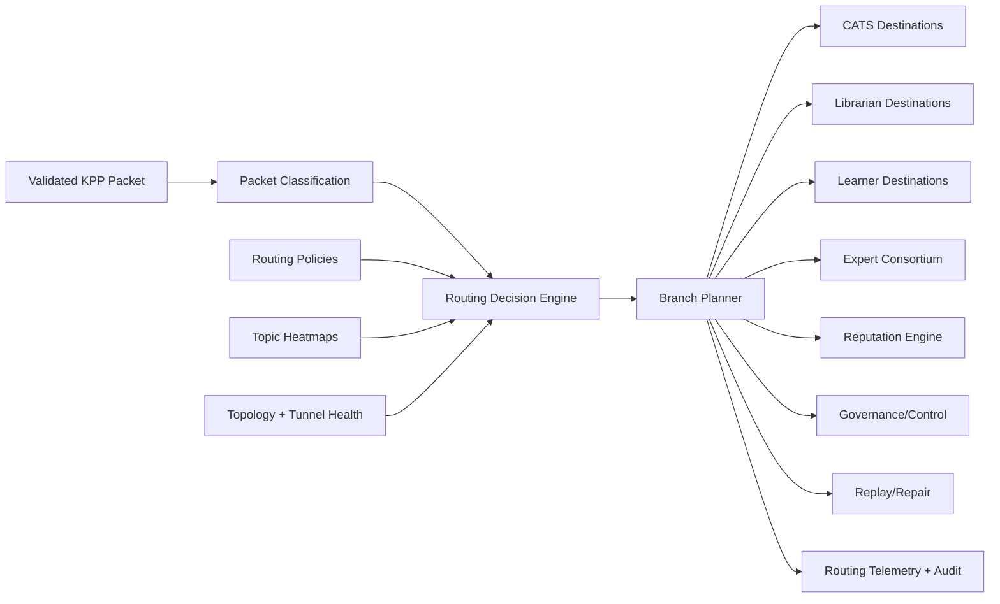

# Mesh Router

**Document ID:** CM-07  
**Status:** Production Architecture Specification  
**Owner:** RocketGPT Architecture  
**Last Updated:** 2026-03-06

## 1. Router Responsibilities

The Mesh Router is the routing brain of the RocketGPT Cognitive Mesh. It performs policy-aware, low-latency packet dispatch across operational, learning, and control horizons while preserving Zero-Trust and governance guarantees.

Primary responsibilities:

- classify incoming packets by family, intent, and criticality;
- select destinations and tunnel classes based on policy and context;
- enforce branch-level authorization and scope boundaries;
- optimize path selection for latency, reliability, and load;
- orchestrate failover, replay triggers, and delivery reconciliation;
- emit routing telemetry and auditable decision traces.

## 2. Packet Classification

Before routing, packets are classified into actionable routing profiles.

Classification dimensions:

- packet family (`knowledge.signal`, `knowledge.bundle`, `knowledge.delta`, `knowledge.directive`, `knowledge.receipt`);
- urgency/priority (`P0`-`P3`);
- trust posture (sender reputation, validation strength, governance tags);
- delivery mode (single, dual, triple, replay);
- workload class (interactive, batch, audit/recovery);
- scope (tenant, session, global-authorized only).

Classification output:

- routing profile ID;
- eligible destination set;
- required acknowledgement mode;
- SLA target and timeout budget.

## 3. Routing Decision Engine

The Routing Decision Engine computes final dispatch plans from packet classification, live topology state, and policy constraints.

Decision inputs:

- classification profile;
- destination capability registry;
- tunnel health and queue depth;
- reputation and confidence signals;
- governance/policy constraints;
- topic heatmap state.

Decision outputs:

- selected destination branches;
- tunnel class and failover path;
- retry strategy and acknowledgement contract;
- observability tags and trace context.

Decisioning rules:

- policy constraints are hard gates;
- SLA-critical traffic receives shortest safe path;
- non-critical traffic may be delayed or downgraded under pressure;
- uncertain or suspicious traffic can be quarantined or routed to replay workflows.

## 4. Routing Policies

Routing policies are declarative rules evaluated per packet and per branch.

Policy categories:

- **security policies:** identity, authorization, scope, trust thresholds.
- **governance policies:** promotion limits, retention class, compliance tags.
- **performance policies:** latency budgets, queue limits, backpressure behavior.
- **resilience policies:** redundancy mode, failover criteria, replay eligibility.
- **cost/efficiency policies:** fan-out bounds, heavy-payload handling, tunnel selection.

Policy behavior:

- deny-by-default when mandatory policy is absent;
- explicit policy precedence and conflict resolution order;
- policy decisions must include reason codes for auditability.

## 5. Topic Heatmaps

Topic heatmaps are continuously updated traffic-intelligence maps used to optimize routing under changing load and behavior.

Tracked dimensions:

- topic throughput and burst rate;
- latency distribution by destination/tunnel;
- drop, retry, and dedup rates;
- error clusters by packet family and sender class;
- replay volume and backlog by topic.

Heatmap use cases:

- proactive congestion avoidance;
- dynamic priority shaping;
- anomaly detection and duplicate storm mitigation;
- preemptive failover for degrading paths.

## 6. Routing Destinations

The Mesh Router supports direct and branched delivery to core destination classes.

Destination classes:

- CATS execution endpoints;
- librarian services (EKL/IKL/SIL interfaces);
- learner services;
- expert consortium endpoints;
- reputation engine;
- governance gates/control handlers;
- replay/repair handlers (T3 flows).

Destination selection rules:

- destination must advertise required capability;
- destination must pass branch-level authorization;
- destination SLA compatibility must match packet profile;
- multi-target delivery uses split-horizon routing contracts.

## 7. Routing SLA

Routing SLA defines acceptable timing and reliability for dispatch decisions and handoff.

SLA targets:

- route decision latency: <= 5 ms p95 for interactive classes;
- dispatch handoff latency: <= 10 ms p95 (decision-to-tunnel enqueue);
- high-priority delivery conformance aligned to tunnel SLA (`P0`/`P1`);
- bounded failover detection and reroute under degradation.

SLA controls:

- queue admission limits by priority;
- adaptive backpressure and shedding for non-critical traffic;
- fail-open/fail-safe behavior explicitly policy-defined per topic.

## 8. Routing Telemetry

Routing telemetry provides real-time health, optimization inputs, and audit evidence.

Required telemetry:

- `route_decision_latency_ms` (p50/p95/p99)
- `route_handoff_latency_ms`
- `route_success_rate`
- `route_failover_rate`
- `route_policy_deny_rate`
- `route_branch_fanout_count`
- `route_queue_depth`
- `route_retry_rate`
- `route_quarantine_rate`
- `route_replay_trigger_rate`

Telemetry requirements:

- dimensions: tenant, topic, packet family, tunnel class, destination class;
- correlation with packet lineage and trace IDs;
- retention aligned with governance and incident forensics.

## Architecture Diagram

## Enforcement Statement

The Mesh Router must make deterministic, policy-compliant routing decisions under Zero-Trust constraints and produce complete telemetry and audit lineage for every dispatch outcome.

