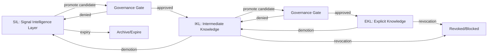

# Knowledge Libraries and Promotion

**Document ID:** CM-08  
**Status:** Production Architecture Specification  
**Owner:** RocketGPT Architecture  
**Last Updated:** 2026-03-06

## 1. SIL (Signal Intelligence Layer)

SIL is the session-scoped, high-velocity intelligence layer that stores transient signals, hypotheses, and improvisations generated during active execution.

Purpose:

- capture short-lived contextual intelligence quickly;
- support rapid adaptation inside a session boundary;
- isolate unproven knowledge from durable libraries.

Characteristics:

- ephemeral retention by default;
- high write rate, low promotion confidence baseline;
- strict tenant/session isolation;
- no global reuse unless explicitly promoted.

## 2. IKL (Intermediate Knowledge Library)

IKL is the governed staging library for knowledge that has passed initial quality checks but is not yet elevated to explicit enterprise-grade truth.

Purpose:

- hold candidate reusable knowledge with evidence trails;
- support controlled experimentation and validation;
- separate validated-but-not-final intelligence from ephemeral SIL signals.

Characteristics:

- medium retention window;
- evidence-indexed and versioned entries;
- scoped reuse across approved tenants/domains;
- subject to ongoing quality and drift checks.

## 3. EKL (Explicit Knowledge Library)

EKL is the durable, high-confidence knowledge library containing explicitly approved, policy-compliant knowledge artifacts for broad operational reuse.

Purpose:

- provide trusted, production-grade knowledge for critical paths;
- ensure stable retrieval with audit-ready provenance;
- serve as authoritative source for explicit standards and accepted patterns.

Characteristics:

- long retention and strict governance controls;
- highest entry threshold and strongest evidence requirements;
- formal versioning and compatibility constraints;
- full audit and revocation traceability.

## 4. Knowledge Lifecycle

Canonical lifecycle:

1. **Ingest to SIL:** packet-derived signal/hypothesis enters session scope.
2. **Stabilize:** dedup, aggregate evidence, and score utility/confidence.
3. **Promote candidate to IKL:** governance-gated transition for reusable intermediate knowledge.
4. **Validate in IKL:** monitor outcomes, drift, and cross-context performance.
5. **Promote to EKL:** explicit approval for durable broad reuse.
6. **Operate and monitor:** continuous telemetry, quality scoring, and policy checks.
7. **Demote or revoke:** if degradation, policy conflict, or integrity issues occur.

## 5. Promotion Rules

Promotion is policy-gated and evidence-driven.

SIL -> IKL rules:

- minimum evidence threshold met;
- positive utility/reliability trend within session or scoped cohort;
- no unresolved governance or security flags;
- explicit promotion action from authorized actor/workflow.

IKL -> EKL rules:

- sustained performance above quality threshold;
- cross-context consistency demonstrated;
- full provenance and reproducibility metadata present;
- governance approval with auditable decision record.

General constraints:

- promotions must preserve lineage links to source packets;
- promotion never bypasses Zero-Trust and governance checks.

## 6. Demotion Rules

Demotion moves knowledge to a lower-trust layer when confidence declines but immediate hard revocation is not required.

Demotion triggers:

- performance regression beyond policy threshold;
- drift signals reducing reliability in target contexts;
- conflicting higher-quality evidence;
- partial compliance concerns under investigation.

Demotion paths:

- EKL -> IKL for revalidation;
- IKL -> SIL or archival quarantine for limited/session-only use.

Demotion requirements:

- retain full history and reason codes;
- notify dependent routing and retrieval systems.

## 7. Revocation Rules

Revocation is a hard invalidation action for unsafe, non-compliant, or corrupted knowledge artifacts.

Revocation triggers:

- security integrity failure or tamper evidence;
- policy/legal non-compliance;
- critical factual invalidation with operational risk;
- unauthorized promotion lineage.

Revocation behavior:

- immediate retrieval block on revoked version;
- propagation of revocation directive to router, libraries, and caches;
- mandatory incident/audit record creation;
- optional rollback to last known-good version when available.

## 8. Governance Interaction

Governance is authoritative for lifecycle transitions and enforcement.

Governance responsibilities:

- define thresholds for promotion, demotion, and revocation;
- enforce tenant/data-classification and retention policies;
- approve or deny lifecycle transitions with reason codes;
- require evidence completeness before durable elevation;
- trigger review workflows for anomalies and disputes.

Integration model:

- lifecycle events are emitted as governed packets/directives;
- governance hooks execute before state transitions;
- all decisions are audit-linked to lineage and evidence.

## Architecture Diagram

## Related Specifications

- [CM-12 Suggestion Outcome Registry](./CM-12-suggestion-outcome-registry.md)
- [CM-14 Consolidated Governance Rules](./CM-14-consolidated-governance-rules.md)
- [CM-18 Learner Reputation Ledger](./CM-18-learner-reputation-ledger.md)

## Enforcement Statement

No knowledge artifact may transition across SIL, IKL, and EKL without governed policy evaluation, evidence-linked lineage, and auditable decision records.

