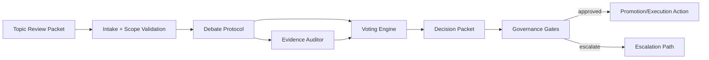

# Expert Consortium

**Document ID:** CM-09  
**Status:** Production Architecture Specification  
**Owner:** RocketGPT Architecture  
**Last Updated:** 2026-03-06

## 1. Purpose of Consortium

The Expert Consortium is the structured multi-expert review system inside the Cognitive Mesh. It provides high-confidence adjudication for complex, ambiguous, or high-impact knowledge decisions before promotion, enforcement, or broad operational use.

Primary objectives:

- reduce single-expert bias and failure modes;
- improve decision quality through adversarial and cooperative review;
- provide evidence-linked consensus or dissent records;
- support governed escalation for unresolved or risky outcomes.

## 2. Expert Roles

The consortium is role-based, with each expert operating under explicit scope and authority limits.

Core roles:

- **Domain Expert:** evaluates technical or domain correctness.
- **Risk Expert:** evaluates operational, security, and compliance risk.
- **Evidence Auditor:** validates provenance quality, reproducibility, and confidence claims.
- **Systems Expert:** evaluates runtime impact, latency, and integration constraints.
- **Governance Liaison:** checks policy compatibility and gate readiness.

Role constraints:

- each role has bounded decision authority;
- role identity must be cryptographically verifiable;
- conflict-of-interest policies must be enforced where applicable.

## 3. Debate Protocol

The consortium uses a staged debate protocol for structured review.

Protocol stages:

1. **Intake:** topic review packet is accepted and scoped.
2. **Positioning:** experts submit initial positions with evidence.
3. **Challenge Round:** experts critique assumptions, evidence, and tradeoffs.
4. **Revision Round:** experts update positions after challenges.
5. **Synthesis:** chair or synthesis engine compiles agreement/disagreement map.
6. **Decision:** voting produces decision packet with rationale and confidence.

Protocol rules:

- all claims must reference evidence IDs;
- unsupported assertions are marked low weight;
- debate windows are time-bounded by SLA class.

## 4. Topic Review Packets

Topic review packets initiate consortium analysis and define review boundaries.

Required fields:

- `topic_id`
- `review_scope` (question, constraints, allowed action space)
- `risk_class`
- `required_roles`
- `evidence_bundle_refs`
- `deadline_at`
- `governance_tags`

Typical family mapping:

- `knowledge.bundle` for primary topic context;
- `knowledge.signal` for supplemental observations;
- `knowledge.directive` for mandatory review triggers.

## 5. Decision Packets

Decision packets are formal outputs of consortium adjudication.

Decision packet contents:

- final disposition (`approve`, `approve_with_conditions`, `reject`, `defer`);
- vote summary and quorum status;
- weighted rationale and key evidence links;
- dissent notes and minority reports;
- recommended next action (promote, hold, replay, escalate);
- governance and SLA metadata.

Decision packets are immutable, signed artifacts and must be auditable end-to-end.

## 6. Voting System

Voting is weighted, role-aware, and evidence-adjusted.

Voting mechanics:

- each eligible role receives a base voting weight;
- weight can be adjusted by reputation and evidence quality score;
- quorum threshold depends on risk class;
- supermajority may be required for high-risk promotions/directives.

Vote outcomes:

- **consensus:** threshold met with low dissent severity;
- **qualified approval:** threshold met with conditions;
- **rejection:** threshold not met or risk veto triggered;
- **deadlock:** insufficient convergence before deadline.

## 7. Escalation

Escalation is required when consortium outcomes are blocked, conflicting, or high risk.

Escalation triggers:

- vote deadlock at or beyond deadline;
- risk veto on otherwise approving vote;
- governance conflict with proposed decision;
- repeated disagreement across replayed reviews.

Escalation paths:

- expanded panel with additional experts;
- governance board adjudication;
- emergency control directive for critical incidents;
- defer-and-observe with explicit risk acceptance.

All escalations must emit trace-linked directives and resolution receipts.

## 8. Creativity Guardrails

The consortium supports creative alternatives but enforces safety and quality guardrails.

Guardrail rules:

- creativity must remain within declared policy and risk boundaries;
- novel proposals require stronger evidence and staged rollout conditions;
- hallucinated or unverifiable claims are disallowed from decision weighting;
- high-variance ideas default to sandbox or limited-scope deployment;
- guardrails cannot be bypassed through majority vote alone.

Creativity is encouraged for option generation, not for bypassing governance or integrity constraints.

## 9. Learner Rating Boundary

Consortium decisions may influence knowledge promotion or execution paths but must never directly modify Learner Ratings. Learner Ratings are computed only by the Independent Rating Engine using external evidence events.

## Architecture Diagram

## Related Specifications

- [CM-16 Topic Review Registry](./CM-16-topic-review-registry.md)
- [CM-17 Consortium Decision Registry](./CM-17-consortium-decision-registry.md)
- [CM-14 Consolidated Governance Rules](./CM-14-consolidated-governance-rules.md)

## Enforcement Statement

No consortium decision may alter durable knowledge or runtime control behavior unless emitted as a signed decision packet and accepted through governance-authorized pathways.

