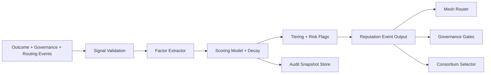

# Learner Reputation Engine

**Document ID:** CM-11  
**Status:** Production Architecture Specification  
**Owner:** RocketGPT Architecture  
**Last Updated:** 2026-03-06

## 1. Purpose

The Learner Reputation Engine (Independent Rating Engine) evaluates the reliability, utility, and governance compliance of learner outputs in the Cognitive Mesh. It produces evidence-linked Learner Ratings and aggregated Learner Reputation profiles that control routing priority, promotion eligibility, and consortium candidacy.

## 2. Scope

The engine applies to:

- learner-generated `knowledge.signal`, `knowledge.bundle`, and `knowledge.delta` packets;
- learner participation in consortium review workflows;
- post-deployment outcome feedback tied to learner proposals.

It does not replace governance gates; it provides trust signals to them.

## 3. Core Responsibilities

- compute per-learner and per-domain Learner Ratings;
- update ratings continuously from validated external outcomes;
- expose explainable score factors and confidence intervals;
- emit rating and reputation events for router, librarian, and governance consumers;
- enforce session isolation for improvise intelligence unless promoted.

## 4. Reputation Scoring System

### 4.1 Reputation Dimensions

Reputation is computed across six dimensions:

- outcome quality (task success, regression rate, rollback impact);
- evidence quality (completeness, provenance, reproducibility);
- calibration quality (confidence-to-correctness alignment);
- governance compliance (policy pass/fail and severity);
- operational efficiency (latency, timeout, fallback pressure);
- collaboration quality (consortium alignment and dissent quality).

### 4.2 Scoring Algorithm

The score uses a weighted factor model with bounded output.

Algorithm outline:

1. normalize each dimension to `[0,1]`;
2. apply versioned dimension weights per domain/risk class;
3. compute weighted sum and penalty terms;
4. apply confidence adjustment for sparse evidence;
5. map to final `0-100` Learner Rating.

Constraints:

- governance or integrity critical failures apply hard penalties;
- correlated low-diversity evidence is down-weighted;
- model version changes must be audit-versioned.

### 4.3 Reputation Decay

Reputation decays over time to prevent stale performance from dominating current trust.

Decay rules:

- inactivity decay applies continuously after configurable idle threshold;
- recent verified outcomes have higher influence than historical outcomes;
- decay rate is stricter for high-risk domains;
- positive recovery is possible through new high-quality evidence.

### 4.4 Scoring Time Windows

Scoring combines multiple windows to balance recency and stability.

Windows:

- short window: rapid behavior change detection;
- medium window: operational stability assessment;
- long window: durable reliability baseline.

Windowed scoring:

- short-window anomalies can trigger provisional tier changes;
- medium/long windows stabilize against transient noise;
- final score blends all windows using policy-defined weights.

### 4.5 Score Explainability

Every score update must produce machine- and human-readable explanations.

Explainability outputs:

- top positive and negative contributing dimensions;
- recent events with largest score impact;
- penalties applied and corresponding policy IDs;
- confidence band and data sufficiency indicator;
- model version and weight profile used.

### 4.6 Reputation Auditability

All scoring decisions must be replayable and trace-linked.

Audit requirements:

- immutable score snapshots with timestamp and lineage keys;
- full event trail for each score delta;
- versioned weights, thresholds, and decay parameters;
- reason-coded tier changes (`trusted`, `provisional`, `restricted`, `blocked`);
- deterministic recomputation support for investigations.

## 5. Inputs and Signals

Primary rating evidence classes (direct Learner Rating inputs only):

- chat outcomes;
- CATS execution outcomes;
- governance decisions (approve/deny/revoke);
- external validated runtime or business telemetry systems.

Derived Signals (advisory only, not direct Learner Rating inputs):

- routing performance metrics;
- incident and quarantine events;
- tunnel-level delivery behavior;
- consortium debate dynamics.

All inputs must include lineage keys (`packet_id`, `trace_id`, `learner_id`).

## 6. Score Outputs

The engine produces:

- `learner_rating` (0-100 external outcome-driven score);
- `learner_reputation_profile` (aggregated historical Learner Rating profile);
- `reputation_tier` (`trusted`, `provisional`, `restricted`, `blocked`);
- `confidence_band` (statistical confidence of score);
- `risk_flags` (policy or behavior warnings);
- `explainability_vector` (top contributing factors).

## 7. Decision Integrations

### Routing Integration

- high-tier learners receive preferred routing for eligible topics;
- restricted learners may be rate-limited, sandboxed, or deprioritized.

### Promotion Integration

- SIL -> IKL and IKL -> EKL promotions consume reputation as an input signal;
- low reputation cannot be used to bypass governance denial.

### Consortium Integration

- learner candidacy and voting weight are reputation-gated;
- risk flags can trigger temporary disqualification.

## 8. Reputation Update Lifecycle

1. ingest lineage-linked outcome events  
2. validate integrity and scope  
3. compute factor deltas  
4. apply weighted score update with temporal decay  
5. assign tier and risk flags  
6. publish reputation event packet  
7. persist auditable score snapshot

## Related Specifications

- [CM-13 Rating Evidence Events](./CM-13-rating-evidence-events.md)
- [CM-18 Learner Reputation Ledger](./CM-18-learner-reputation-ledger.md)
- [CM-12 Suggestion Outcome Registry](./CM-12-suggestion-outcome-registry.md)

## 9. Safety and Anti-Gaming Controls

- anomaly detection for suspicious self-reinforcing feedback loops;
- cap score lift from correlated or low-diversity evidence sources;
- penalize unverifiable claims and repeated rollback-causing deltas;
- separate training/evaluation paths to reduce leakage bias;
- require governance review on rapid score spikes.

## 10. Auditability Requirements

- every score change must be traceable to source events;
- snapshots must be immutable and replayable;
- factor weights and policy thresholds must be versioned;
- demotion/block actions require explicit reason codes.

## 11. Key Metrics

- `learner_reputation_score`
- `reputation_update_latency_ms`
- `reputation_confidence`
- `reputation_demotion_rate`
- `reputation_block_rate`
- `reputation_recovery_rate`
- `reputation_disagreement_rate` (score vs governance outcomes)

## Architecture Diagram

## Enforcement Statement

Learner reputation decisions must be evidence-driven, non-bypassable by a single subsystem, and fully auditable across routing, promotion, and governance interactions.

