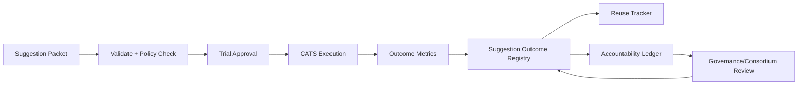

# Suggestion Outcome Registry

**Document ID:** CM-12  
**Status:** Production Architecture Specification  
**Owner:** RocketGPT Architecture  
**Last Updated:** 2026-03-06

## 1. Suggestion Lifecycle

The Suggestion Outcome Registry tracks learner suggestions from creation to terminal disposition.

Lifecycle states:

1. `proposed`: learner emits suggestion packet with evidence.
2. `validated`: schema, integrity, and policy prechecks pass.
3. `accepted_for_trial`: suggestion approved for bounded execution scope.
4. `executed`: CATS applies suggestion in one or more runs.
5. `evaluated`: outcomes measured against baselines and constraints.
6. `closed`: finalized as `adopted`, `rejected`, `rolled_back`, or `expired`.

Each transition must be timestamped and linked to packet lineage.

## 2. Linking Suggestions to CATS

Every suggestion must be explicitly tied to CATS execution context.

Required links:

- `suggestion_id` -> `cats_plan_id`
- `suggestion_id` -> `cats_run_id` (one-to-many supported)
- `suggestion_id` -> `task_type` and environment scope
- `suggestion_id` -> governing policy decision ID

Linking rules:

- no suggestion may affect CATS without a resolvable `suggestion_id`;
- CATS must emit execution receipts referencing originating suggestion;
- replayed runs retain original suggestion lineage plus replay markers.

## 3. Outcome Metrics

Outcome measurement is mandatory for all executed suggestions.

Core metrics:

- success delta vs baseline (`quality_delta`);
- latency impact (`plan_latency_ms`, `first_response_ms`);
- reliability impact (`timeout_rate`, `fallback_rate`);
- behavioral adoption impact (`improvise_rate`, `deep_mode_rate`);
- governance impact (policy pass/fail, exceptions raised).

Measurement rules:

- metrics must be windowed and baseline-aware;
- negative safety or compliance outcomes override positive performance gains;
- confidence score must accompany low-sample evaluations.

## 4. Reuse Tracking

Registry tracks where and how suggestions are reused across tasks and contexts.

Reuse dimensions:

- reuse count by task/domain;
- tenant/session reuse boundaries;
- successful vs failed reuse ratio;
- time-to-reuse after initial adoption;
- dependency graph of derived suggestions.

Controls:

- SIL-scope suggestions are session-isolated unless promoted;
- IKL/EKL promoted suggestions gain broader reuse eligibility;
- reuse in new contexts requires policy-compatible scope checks.

## 5. Accountability Model

The registry enforces clear accountability for each suggestion decision and impact.

Accountability entities:

- proposer (learner/expert/service principal);
- approver (governance/consortium actor);
- executor (CATS runtime context);
- evaluator (metrics/review subsystem).

Accountability requirements:

- all actors must be identity-verifiable;
- every decision must have reason codes and evidence references;
- adverse outcomes must map to responsible decision points;
- rollback and revocation actions must link to originating suggestion IDs;
- immutable audit records must support deterministic incident reconstruction.

## Architecture Diagram

## Enforcement Statement

No learner suggestion may be promoted, reused, or trusted without lineage-linked outcome evidence and accountable decision records in the Suggestion Outcome Registry.

