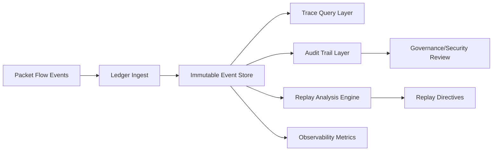

# Knowledge Packet Ledger

**Document ID:** CM-15  
**Status:** Production Architecture Specification  
**Owner:** RocketGPT Architecture  
**Last Updated:** 2026-03-06

## 1. Packet Lifecycle Events

The Knowledge Packet Ledger records all material state transitions for every packet in the Cognitive Mesh.

Required lifecycle events:

- `packet.created`
- `packet.validated`
- `packet.authorized`
- `packet.routed`
- `packet.delivered`
- `packet.acknowledged`
- `packet.retried`
- `packet.quarantined`
- `packet.replayed`
- `packet.expired`
- `packet.closed`

Event records must be append-only, timestamped, and linked to packet lineage keys.

## 2. Traceability

The ledger provides end-to-end packet traceability across producers, routers, tunnels, targets, and replay paths.

Trace keys:

- `packet_id`
- `parent_packet_id`
- `trace_id`
- `span_id`
- `correlation_id`
- `tenant_id`
- `session_id`
- `branch_id` (for split-horizon delivery)

Traceability requirements:

- every hop must emit lineage-consistent events;
- branch-level outcomes must map back to original packet identity;
- replayed packets must preserve original and replay lineage links.

## 3. Audit Trails

The ledger is a primary audit source for governance, security, and incident review.

Audit record requirements:

- actor identity and role for each transition;
- policy decisions and reason codes;
- integrity validation outcomes;
- authorization allow/deny outcomes;
- destination and tunnel class decisions;
- receipts and disposition status (`accepted`, `rejected`, `deferred`, `duplicate_dropped`, `quarantined`).

Audit controls:

- immutable storage with access control;
- retention by governance class;
- deterministic query support for forensic reconstruction.

## 4. Replay Analysis

Replay analysis uses ledger history to detect missing acknowledgements, inconsistent outcomes, and recovery candidates.

Replay analysis capabilities:

- identify lifecycle gaps between expected and observed states;
- reconstruct packet flow timelines per topic, tenant, and branch;
- compare original vs replay outcomes;
- detect recurring failure patterns and repair effectiveness;
- validate replay safety (no unauthorized or duplicate side effects).

Replay outputs:

- replay candidate sets;
- replay directives with reason codes;
- reconciliation status and closure evidence.

## 5. Observability Metrics

The ledger must emit and support metrics for lifecycle health and reliability.

Core metrics:

- `ledger_event_ingest_rate`
- `ledger_write_latency_ms`
- `packet_lifecycle_completion_rate`
- `packet_ack_gap_rate`
- `packet_replay_trigger_rate`
- `packet_replay_success_rate`
- `packet_quarantine_rate`
- `packet_retry_rate`
- `packet_end_to_end_latency_ms`
- `packet_audit_query_latency_ms`

Metric dimensions:

- packet family
- tunnel class
- topic
- tenant
- destination class
- lifecycle state

## Architecture Diagram

## Enforcement Statement

No production packet flow is considered complete unless lifecycle events are ledgered, trace-linked, and queryable for audit and replay analysis.

