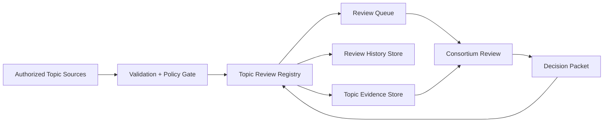

# Topic Review Registry

**Document ID:** CM-16  
**Status:** Production Architecture Specification  
**Owner:** RocketGPT Architecture  
**Last Updated:** 2026-03-06

## 1. Topic Creation Sources

The Topic Review Registry accepts topics only from authorized upstream producers. The Expert Consortium can review topics but cannot originate them.

Authorized source classes:

- CATS execution anomaly and improvement detectors;
- governance-triggered review directives;
- learner suggestion escalation workflows;
- operator-initiated review requests via approved control interfaces;
- replay/incident analysis systems identifying unresolved decisions.

Source requirements:

- cryptographically verifiable source identity;
- valid tenant/session and policy scope;
- required evidence references at submission time or declared evidence acquisition plan.

### Minimal Topic Schema

Required fields:

- `topic_id`
- `tenant_id`
- `topic_source`
- `risk_class`
- `state`
- `created_at`
- `last_reviewed_at`

Required indexes:

- `tenant_id`
- `state`
- `risk_class`

## 2. Topic Lifecycle

Each topic follows a governed lifecycle with auditable transitions.

Lifecycle states:

1. `submitted`
2. `validated`
3. `queued_for_review`
4. `in_review`
5. `decision_pending`
6. `decided` (`approved`, `approved_with_conditions`, `rejected`, `deferred`)
7. `closed` (implemented, archived, or revoked)

Lifecycle rules:

- every transition requires actor identity, timestamp, and reason code;
- state transitions must pass governance and authorization checks;
- deferred topics must carry explicit re-entry criteria and deadline metadata.

## 3. Review History

The registry preserves complete review history for each topic, including debate rounds, votes, dissent, and escalations.

Required history records:

- topic version snapshots;
- consortium participant roster and role assignments;
- debate artifacts and evidence references per round;
- voting outcomes, quorum status, and confidence levels;
- escalation events and final resolution path;
- linked decision packet identifiers.

History controls:

- append-only history log with immutable event IDs;
- deterministic ordering for replay and forensics;
- branch-aware tracking for parallel review paths.

## 4. Topic Evidence Storage

Topic evidence storage holds structured references and integrity metadata for all artifacts used in review and decisioning.

Stored evidence classes:

- execution telemetry summaries;
- benchmark and evaluation outputs;
- governance findings;
- external references admitted through policy;
- replay and repair analysis artifacts.

Storage requirements:

- content-addressable artifact references with integrity hash;
- provenance metadata (`source_id`, `captured_at`, `policy_tags`);
- tenant/session/classification access controls;
- retention and deletion by governance policy;
- fast retrieval for audit, replay, and re-review workflows.

## Architecture Diagram

## Enforcement Statement

No topic may be reviewed, decided, or promoted in Cognitive Mesh workflows unless its source, lifecycle transitions, review history, and evidence references are fully registered and auditable.

