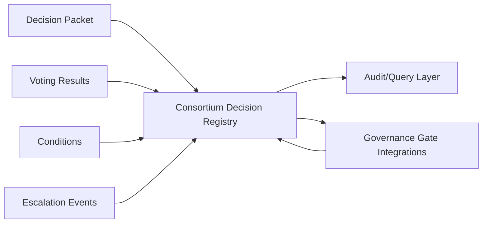

# Consortium Decision Registry

**Document ID:** CM-17  
**Status:** Production Architecture Specification  
**Owner:** RocketGPT Architecture  
**Last Updated:** 2026-03-06

## 1. Decision Packets

The Consortium Decision Registry stores signed, immutable decision packets produced by Expert Consortium review workflows.

Each decision packet must include:

- `decision_id`
- `topic_id`
- `decision_type` (`approve`, `approve_with_conditions`, `reject`, `defer`)
- `decision_timestamp`
- `consortium_session_id`
- `reason_summary`
- `evidence_refs`
- `governance_tags`
- `integrity` (hash, signature, key reference)

Storage rules:

- only governance-admitted decision packets are persisted as authoritative;
- packet lineage must link to topic review and evidence artifacts;
- packet updates create new versions; prior versions remain immutable.

## 2. Voting Results

The registry stores full voting outcomes associated with each decision packet.

Required voting artifacts:

- quorum status and threshold policy;
- role-weighted vote tally;
- per-role vote dispositions;
- confidence score and uncertainty band;
- dissent entries with evidence references;
- veto flags and veto rationale (if applicable).

Voting records must be queryable by topic, role, decision window, and risk class.

## 3. Conditions

For conditional decisions, the registry stores explicit execution and compliance conditions.

Condition fields:

- `condition_id`
- `condition_type` (technical, governance, operational, security)
- `required_action`
- `owner_principal`
- `deadline_at`
- `verification_criteria`
- `status` (`open`, `met`, `failed`, `waived`)

Condition rules:

- conditional approvals are inactive until required condition state is satisfied per policy;
- condition state changes require signed verification events;
- unmet critical conditions can auto-trigger escalation or revocation workflows.

## 4. Escalation History

The registry maintains complete escalation lineage for decisions that could not be resolved at the initial consortium level.

Escalation records include:

- escalation trigger event and reason code;
- escalation path (expanded panel, governance board, emergency control);
- participant and authority changes;
- intermediate outcomes and timestamps;
- final resolution packet and closure status.

Escalation controls:

- all escalation transitions are append-only and audit-immutable;
- escalation outcomes must link back to original `decision_id`;
- superseded decisions remain accessible with explicit supersession metadata.

## 5. Decision State Machine

Canonical state transitions:

- `proposed` -> `under_review` -> `approved`
- `proposed` -> `under_review` -> `rejected`
- `proposed` -> `under_review` -> `conditional` -> `executed`
- `proposed` -> `under_review` -> `conditional` -> `expired`

Timeout and escalation rules:

- if `under_review` exceeds topic SLA window, emit `escalation.timeout.review` and escalate;
- if `conditional` exceeds `deadline_at` with unmet required conditions, transition to `expired` and emit escalation event;
- repeated deadlock or veto in `under_review` triggers governance-board escalation path;
- every timeout or escalation transition must include reason code, actor/system identity, and timestamp.

## Architecture Diagram

## Enforcement Statement

No consortium decision is operationally effective unless its packet, voting record, condition set, and escalation lineage are durably stored and auditable in the Consortium Decision Registry.

