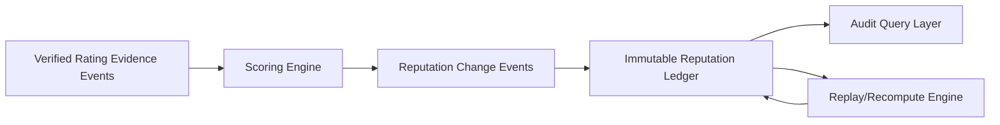

# Learner Reputation Ledger

**Document ID:** CM-18  
**Status:** Production Architecture Specification  
**Owner:** RocketGPT Architecture  
**Last Updated:** 2026-03-06

## 1. Reputation Events

The Learner Reputation Ledger is an immutable event store that records all evidence-backed reputation actions for learners across the Cognitive Mesh.

Required reputation event types:

- `reputation.evidence.accepted`
- `reputation.evidence.rejected`
- `reputation.score.recomputed`
- `reputation.score.adjusted`
- `reputation.tier.changed`
- `reputation.penalty.applied`
- `reputation.recovery.applied`
- `reputation.override.denied`
- `reputation.model.version_changed`

Each event must include:

- `event_id`
- `learner_id`
- `occurred_at`
- `tenant_id`
- `trace_id`
- `reason_code`
- `actor_id` (system/service/human principal)

### Canonical Ledger Schema

Required fields:

- `event_id`
- `learner_id`
- `suggestion_id`
- `evidence_type`
- `source_system`
- `impact_score`
- `timestamp`
- `schema_version`

## 2. Audit Trails

The ledger is a primary audit artifact for governance, security, and incident review.

Audit requirements:

- append-only write semantics with immutable event payloads;
- cryptographic integrity checks on event records;
- actor identity, policy ID, and decision reason on every event;
- deterministic event ordering for replay investigations;
- access-controlled query interfaces with read audit logs.

Audit queries must support:

- per learner timeline reconstruction;
- per policy impact analysis;
- cross-event correlation with packet and topic registries.

## 3. Evidence Linking

Every scoring-relevant event must link to verified evidence sources.

Mandatory linkage fields:

- `evidence_event_id` (REE identifier)
- `packet_id`
- `suggestion_id` (when applicable)
- `decision_id` (consortium/governance linkage)
- `baseline_ref`
- `integrity_hash`

Linking rules:

- only verified and policy-compliant evidence can be scoring-eligible;
- missing or broken links force non-scoring event status;
- lineage links must remain stable across replay and recomputation.

## 4. Score Change Tracking

The ledger tracks every reputation score delta as an explicit, explainable change record.

Required score-change fields:

- `score_before`
- `score_after`
- `delta`
- `dimension_breakdown` (outcome, evidence, calibration, compliance, operations, collaboration)
- `window_profile` (short/medium/long window contributions)
- `decay_applied`
- `model_version`
- `confidence_band`

Tracking rules:

- no in-place score mutation without a corresponding ledger event;
- tier transitions must reference the exact score-change event;
- recomputation must produce comparable deterministic outputs under the same model version.

## 5. Schema Version Compatibility

Versioning rules:

- `schema_version` must follow semantic versioning (`MAJOR.MINOR.PATCH`);
- consumers must reject unknown major versions;
- consumers must ignore unknown optional fields for supported major versions;
- producers must not remove required fields without a major version increment;
- registry must retain compatibility readers for at least two previous minor versions.

## Architecture Diagram

## Enforcement Statement

No Learner Rating or Learner Reputation profile is valid for routing, promotion, or consortium selection unless its evidence links and score deltas are immutably recorded in the Learner Reputation Ledger.

