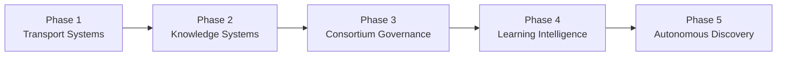

# Cognitive Mesh Architecture Roadmap

**Document ID:** CM-19  
**Status:** Production Architecture Specification  
**Owner:** RocketGPT Architecture  
**Last Updated:** 2026-03-07

## Batch Completion Status

### Batch-8 - Cognitive Experience Layer (CEL): Completed

- structured experience record contract implemented;
- outcome and circumstantial models added;
- deterministic capture policy added;
- in-memory repository and retrieval hooks added;
- post-outcome runtime integration completed;
- CEL documentation and tests committed.

## 1. Phase 1 Transport Systems

Objective: establish secure, low-latency packet transport foundations.

Scope:

- implement KPP envelope/payload validation baseline;
- deploy messenger tunnel classes (`T0`, `T1`, `T2`, `T3`);
- implement Zero-Trust gate, dedup ingress, and receipt protocol;
- ship mesh router core with policy-aware tunnel selection;
- establish packet ledger and transport observability.

Exit criteria:

- end-to-end packet flow stable under SLA targets;
- mandatory authN/authZ/integrity checks active on all routes;
- replay-capable transport path available via `T3`.

## 2. Phase 2 Knowledge Systems

Objective: operationalize SIL/IKL/EKL libraries and governed knowledge flow.

Scope:

- stand up SIL, IKL, and EKL stores with lineage indexing;
- enable governed promotion and demotion workflows;
- implement suggestion outcome registry and topic review registry;
- integrate packet-ledger links into knowledge lifecycle events;
- deliver retrieval/read APIs with scope-aware access control.

Exit criteria:

- SIL -> IKL -> EKL lifecycle operational with governance gates;
- promotion, demotion, and revocation events fully auditable;
- reuse tracking enabled for approved knowledge artifacts.

## 3. Phase 3 Consortium Governance

Objective: deploy formal consortium review and decision governance.

Scope:

- launch expert consortium debate and voting protocol;
- implement decision packets, conditions, and escalation workflows;
- deploy dynamic merit-based membership and chair constraints;
- enforce consolidated governance laws across consortium interactions;
- integrate decision registry with topic and evidence registries.

Exit criteria:

- high-impact decisions require consortium/governance path;
- voting, dissent, and escalation trails are immutable and queryable;
- membership rotation and bias controls enforced by policy.

## 4. Phase 4 Learning Intelligence

Objective: activate evidence-driven learning and reputation control loops.

Scope:

- deploy learner reputation engine with multi-window scoring;
- operationalize Rating Evidence Events (REE) verification pipeline;
- deploy learner reputation ledger and score explainability APIs;
- integrate reputation outputs into routing and promotion decisions;
- enforce learner accountability for CATS outcome impact.

Exit criteria:

- reputation updates are evidence-linked and replayable;
- routing and promotion consume reputation tiers safely;
- anti-gaming and anomaly detection controls active.

## 5. Phase 5 Autonomous Discovery

Objective: enable bounded self-evolving intelligence under strict governance.

Scope:

- enable autonomous topic discovery from runtime/replay signals;
- automate candidate hypothesis generation and bounded trials;
- expand adaptive routing from topic heatmaps and reputation feedback;
- implement autonomous promotion recommendations with human override;
- strengthen closed-loop discovery -> validation -> governance -> adoption.

Exit criteria:

- autonomous discovery operates within policy envelopes;
- novel knowledge can be safely trialed and governed at scale;
- system remains fully auditable with deterministic incident replay.

## Milestone Governance and Controls

- each phase requires formal readiness review before progression;
- no phase can bypass Zero-Trust, governance, or auditability requirements;
- cross-phase regression benchmarks must be passed before release.

## Phase-to-Document Dependency Matrix

| Phase | Primary Documents |
| --- | --- |
| Phase 1 Transport Systems | CM-02, CM-03, CM-04, CM-05, CM-06, CM-07, CM-15 |
| Phase 2 Knowledge Systems | CM-08, CM-12, CM-16 |
| Phase 3 Consortium Governance | CM-09, CM-10, CM-14, CM-17 |
| Phase 4 Learning Intelligence | CM-11, CM-13, CM-18 |
| Phase 5 Autonomous Discovery | CM-01, CM-19 (with governed integration of all prior phase capabilities) |

## Architecture Diagram

## Enforcement Statement

Roadmap progression is conditional on security, governance, and audit conformance at each phase gate; capability expansion cannot outpace control maturity.

