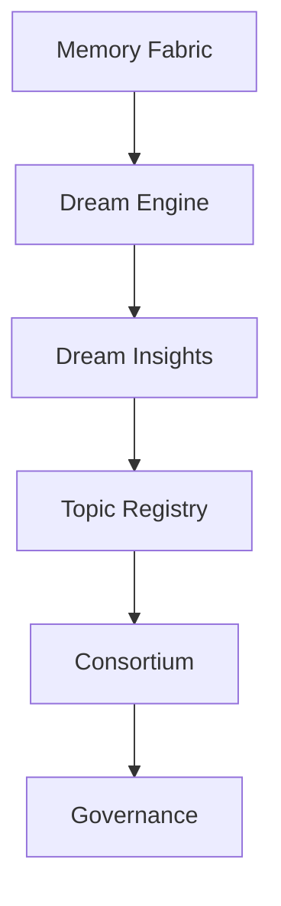

# RocketGPT Dream Engine Architecture

**Document ID:** CM-27  
**Status:** Production Architecture Specification  
**Owner:** RocketGPT Architecture  
**Last Updated:** 2026-03-06

## 1. Purpose

The Dream Engine is RocketGPT's offline cognition subsystem. It executes non-interactive "dream cycles" to discover patterns, synthesize creative hypotheses, and consolidate memory without direct user interaction.

Purpose outcomes:

- improve intelligence quality from accumulated memory and outcomes;
- generate speculative insights in a controlled offline path;
- prepare reviewable proposals for consortium and governance workflows.

## 2. Dream Cycle Triggers

Dream cycles run when one or more triggers are met:

- scheduled intervals;
- system idle periods;
- large knowledge ingestion events;
- high volume of execution outcomes;
- major consortium decisions.

Trigger policy is governance-configurable and tenant-aware.

## 3. Dream Engine Components

### Dream Scheduler

Selects run windows, workload budgets, and trigger eligibility.

### Memory Replay Engine

Replays relevant Memory Fabric records and lineage for analysis.

### Pattern Discovery Engine

Finds recurrent associations, anomalies, and success/failure motifs.

### Simulation Engine

Runs bounded what-if evaluations on candidate ideas and inferred strategies.

### Creative Synthesizer

Combines patterns and contexts to generate novel but constrained hypotheses.

### Dream Insight Generator

Produces structured Dream Insights and emits them to Dream Memory.

## 4. Dream Processing Pipeline

`Dream Trigger -> Memory Replay -> Pattern Discovery -> Simulation / Creative Synthesis -> Dream Insight -> Dream Memory -> Topic Proposal -> Consortium Review`

Pipeline guarantees:

- all stages are offline and non-executing;
- all outputs are lineage-linked to source memory;
- no stage can directly write EKL or trigger direct execution.

## 5. Dream Memory

Dream Memory is a dedicated memory type for speculative offline cognition outputs.

Dream Insight tags:

- `hypothesis`
- `pattern`
- `simulation`
- `creative`

Dream insights remain speculative until validated because they are inference products, not direct operational evidence. They require review and policy approval before promotion to governed knowledge.

## 6. Dream Insight Schema

```json
{
  "dream_insight_id": "drm_01JZB9W3P8R2M6C4T1A7D5F9K0",
  "type": "hypothesis",
  "confidence": 0.71,
  "topic": "routing_efficiency_under_burst_load",
  "generated_from": [
    "pat_01JZA1V3Y8M2Q6H4T1R9C7N5L0",
    "res_01JZA1Q2S8X4M2F7A9D0P3T6N4"
  ],
  "timestamp": "2026-03-06T14:05:12.776Z"
}
```

## 7. Dream Safety Rules

Dream outputs must never:

- modify EKL directly;
- execute CATS workflows;
- modify Learner Ratings;
- bypass governance.

Dream outputs may only produce topic proposals for consortium review.

## 8. Dream Lifecycle

`Dream Insight -> Dream Memory -> Topic Review Packet -> Consortium Evaluation -> Possible Knowledge Promotion`

Lifecycle controls:

- promotion is conditional on evidence-backed validation;
- governance gates are mandatory for any durable knowledge transition;
- rejected insights remain non-authoritative and may be archived.

## 9. Metrics

Required Dream Engine metrics:

- `dream_insights_generated`
- `insights_promoted`
- `insights_rejected`
- `insight_accuracy`

Metrics must be tracked by dream type, topic class, and validation outcome.

## 10. Architecture Placement



## Related Specifications

- [CM-26 Intelligence Output Model](./CM-26-intelligence-output-model.md)
- [CM-28 Memory Fabric Architecture](./CM-28-memory-fabric-architecture.md)
- [CM-16 Topic Review Registry](./CM-16-topic-review-registry.md)
- [CM-14 Consolidated Governance Rules](./CM-14-consolidated-governance-rules.md)

## Enforcement Statement

The Dream Engine is an offline proposal system only. It must remain Zero-Trust governed, execution-isolated, and non-authoritative until consortium and governance validation is complete.
