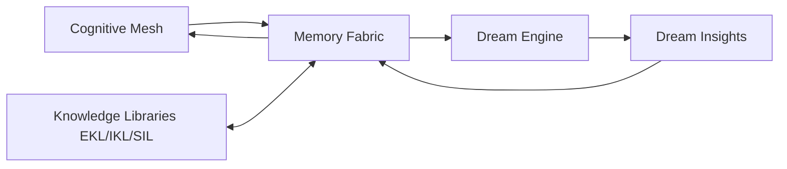

# RocketGPT Memory Fabric Architecture

**Document ID:** CM-28  
**Status:** Production Architecture Specification  
**Owner:** RocketGPT Architecture  
**Last Updated:** 2026-03-06

## 1. Purpose

RocketGPT requires a unified Memory Fabric to prevent fragmentation of intelligence across isolated stores. Cognitive Mesh components produce correlated outputs (reasoning traces, execution outcomes, governance decisions, consortium judgments, and dream insights) that must remain lineage-linked and queryable as one knowledge substrate.

A unified fabric is required to:

- preserve cross-domain context and causality;
- avoid duplicated or conflicting memory states across subsystems;
- support governed learning and replay-safe auditability;
- enable low-latency retrieval for active execution and long-horizon refinement.

## 2. Memory Classes

### Working Memory

Stores short-lived task/session context for active reasoning and execution.  
Retention: ephemeral; expires at session end or short TTL.

### Recall Memory

Stores retrievable historical facts, prior outcomes, and reusable context fragments.  
Retention: medium to long; subject to relevance and governance retention policies.

### Creative Memory

Stores divergent hypotheses, alternative strategies, and novel idea paths.  
Retention: medium; promoted or pruned based on evidence and quality scoring.

### Result-Based Memory

Stores execution outcomes, metrics deltas, and result-linked evidence bundles.  
Retention: long for high-impact outcomes; otherwise policy-governed archival.

### Consortium Decision Memory

Stores consortium decision packets, vote summaries, conditions, and escalation lineage.  
Retention: long; audit-grade immutable retention.

### Cognitive Memory

Stores distilled reasoning abstractions, successful patterns, and reusable cognitive strategies.  
Retention: long; governed promotion from candidate to validated memory.

### Dream Memory

Stores Dream Engine outputs including dream insights, synthetic hypotheses, and exploratory associations.  
Retention: medium by default; promoted only through governance-approved validation paths.

### Governance Memory

Stores policy decisions, gate outcomes, compliance artifacts, and revocation history.  
Retention: long; immutable audit-compliant retention.

### Relationship Memory

Stores cross-entity linkage graphs (topic-to-decision, suggestion-to-outcome, evidence-to-rating impact).  
Retention: long; maintained with lineage integrity constraints.

## 3. Memory Flow

Memory write flow follows the Cognitive Mesh learning chain:

`Decision Output -> Action Execution -> Result Output -> Evidence Events -> Learning Output -> Memory Fabric`

Flow behavior:

- each stage emits lineage-linked packets/events;
- memory writes are accepted only after integrity, scope, and governance validation;
- writes can produce signal or candidate records before validation promotion.

Reference: [CM-26](./CM-26-decision-to-learning-pipeline.md)

## 4. Memory Governance

All Memory Fabric writes must satisfy:

- Zero-Trust message validation and authorization controls;
- governance policy gates for classification, retention, and promotion eligibility;
- tenant/session isolation and least-privilege access.

No memory object may bypass validation, and no write is authoritative without policy-admitted evidence.

References:

- [CM-05 Zero-Trust Messaging Architecture](./CM-05-zero-trust-messaging.md)
- [CM-14 Consolidated Governance Rules](./CM-14-consolidated-governance-rules.md)

## 5. Memory Lifecycle

### signal

Initial low-confidence memory signal emitted from runtime or learning events.

### candidate memory

Structured memory candidate with evidence links, awaiting validation.

### validated memory

Governance-approved, evidence-backed memory eligible for operational reuse.

### archived memory

Historical or superseded memory retained for replay, audit, and long-term analysis.

Lifecycle transitions are policy-controlled and fully auditable.

## 6. Memory Storage Layers

### Hot Memory

Low-latency active layer for current sessions and high-frequency retrieval.  
Performance goal: millisecond-class reads/writes for active Cognitive Mesh paths.

### Warm Memory

Balanced layer for frequently reused validated knowledge and nearline historical context.  
Performance goal: low-latency retrieval with higher durability and indexing depth.

### Cold Memory

Durable archival layer for replay, compliance, and longitudinal intelligence analysis.  
Performance goal: throughput and durability over immediate latency.

## 7. Integration with Dream Engine

Dream Engine consumes curated Memory Fabric inputs (validated memory + selected candidate signals) to generate Dream Insights, synthetic hypotheses, and exploratory associations.

Integration rules:

- Dream Engine reads are scope- and policy-constrained;
- Dream outputs are written as Dream Memory candidates, not auto-validated truths;
- promotion of dream-derived insights requires evidence-backed validation and governance approval.

Reference: [CM-27](./CM-27-dream-engine-architecture.md)

## 8. Architecture Diagram

## Enforcement Statement

The Memory Fabric is the authoritative, governed memory substrate for Cognitive Mesh intelligence continuity. All memory writes and promotions must remain Zero-Trust validated, evidence-linked, and audit-replayable.
