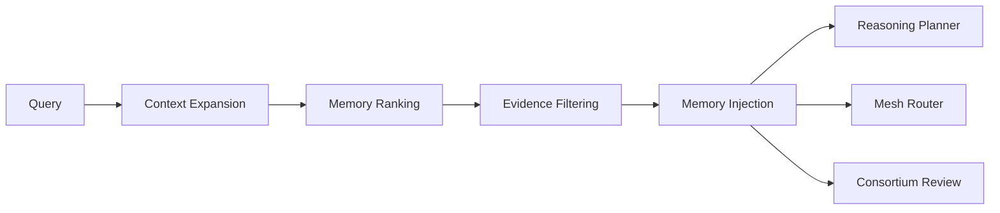

# RocketGPT Memory Retrieval Engine

**Document ID:** CM-30  
**Status:** Production Architecture Specification  
**Owner:** RocketGPT Architecture  
**Last Updated:** 2026-03-06

## 1. Retrieval Goals

The Memory Retrieval Engine provides relevant intelligence from the Memory Fabric to active reasoning and control flows with minimal latency and governed confidence.

Primary goals:

- return context-appropriate memory with deterministic ranking;
- preserve evidence and governance constraints at retrieval time;
- minimize retrieval overhead on critical reasoning paths;
- support explainable, trace-linked memory injection.

## 2. Retrieval Modes

### Context Retrieval

Retrieves session/task-relevant memory fragments for immediate planning and execution context.

### Pattern Retrieval

Retrieves Cognitive Memory patterns with historical success signatures and usage contexts.

### Outcome Retrieval

Retrieves Result-Based Memory records and associated metrics deltas for expected outcome estimation.

### Decision Retrieval

Retrieves Consortium Decision Memory and Governance Memory artifacts for policy-constrained adjudication.

### Creative Retrieval

Retrieves Creative Memory and eligible Dream Memory candidates for bounded hypothesis generation.

## 3. Retrieval Pipeline

Canonical pipeline:

`Query -> Context expansion -> Memory ranking -> Evidence filtering -> Memory injection`

Stage behavior:

- **Query:** caller submits intent, scope, and constraints.
- **Context expansion:** engine enriches query with lineage, task, and policy context.
- **Memory ranking:** candidate memories are scored and ordered.
- **Evidence filtering:** non-compliant or low-evidence candidates are removed.
- **Memory injection:** selected memory bundle is injected into downstream consumer context.

## 4. Ranking Strategy

Ranking combines weighted factors with policy-aware filtering.

Ranking factors:

- **Relevance score:** semantic fit to query intent and execution scope.
- **Recency:** stronger preference for recent validated memory when quality is comparable.
- **Outcome success rate:** preference for memory linked to higher measured success.
- **Governance approval:** preference and eligibility gating for governance-approved memory.

Ranking constraints:

- unapproved or revoked memory cannot outrank validated memory;
- tenant/session scope violations produce hard exclusion;
- ranking outputs must include explainability metadata.

## 5. Retrieval Integration

### Reasoning Planner

Retrieval supplies context, patterns, and outcomes to improve planning quality and reduce repeated failure paths.

### Mesh Router

Retrieval provides route-affecting knowledge (for example topic behavior and prior outcomes) for policy-aware dispatch optimization.

### Consortium Review

Retrieval provides decision history, objections, conditions, and evidence lineage to accelerate structured review.

## 6. Performance Targets

- Memory retrieval latency target: `< 50 ms` end-to-end for interactive paths.
- p95 target applies to `Query -> Memory injection` lifecycle.
- degraded-mode fallback must still return bounded, governance-safe memory context.

## Architecture Diagram

## Enforcement Statement

The Memory Retrieval Engine must return low-latency, evidence-filtered, governance-compliant memory outputs suitable for direct use in reasoning, routing, and consortium workflows.
