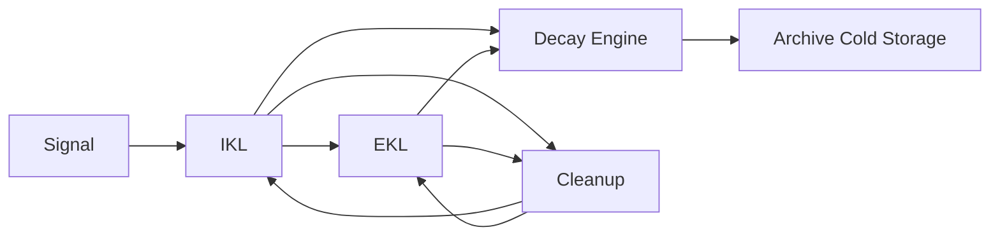

# Memory Promotion and Decay

**Document ID:** CM-31  
**Status:** Production Architecture Specification  
**Owner:** RocketGPT Architecture  
**Last Updated:** 2026-03-06

## 1. Promotion

Memory promotion defines how knowledge progresses from transient signals to durable reusable intelligence.

Canonical path:

`Signal -> IKL -> EKL`

Promotion behavior:

- signals are first captured as candidate memory;
- validated candidates may be promoted into IKL for governed intermediate reuse;
- proven, policy-approved memory is promoted from IKL to EKL for durable broad reuse.

## 2. Promotion Criteria

A memory object is eligible for promotion only when all required criteria are satisfied.

### Outcome Success

- linked outcomes show measurable positive impact against baseline;
- no unresolved high-severity regressions in relevant contexts.

### Repetition

- memory demonstrates repeatable effectiveness across sufficient usage instances;
- isolated one-off success is insufficient for durable promotion.

### Governance Approval

- governance gates approve policy, scope, retention, and compliance posture;
- promotion decisions are recorded with evidence and reason codes.

## 3. Decay

Unused or weakly performing memory gradually decays in retrieval importance over time.

Decay rules:

- low-usage memory weight decreases with inactivity windows;
- repeated low-value outcomes accelerate decay;
- recent high-quality outcomes can counter decay and restore rank.

Decay affects ranking and retrieval priority, not immutable historical audit records.

## 4. Archiving

Old or superseded knowledge is moved to cold storage for long-term retention and replay use.

Archiving triggers:

- sustained inactivity beyond policy threshold;
- supersession by higher-quality or newer validated memory;
- lifecycle end under retention policy.

Archiving rules:

- archived memory remains lineage-linked and queryable for audit/replay;
- archived memory is excluded from hot-path retrieval unless explicitly requested.

## 5. Memory Cleanup

Memory cleanup ensures coherence, efficiency, and consistency of the Memory Fabric.

### Duplicate Removal

- exact and semantic duplicate memories are merged or removed using dedup policies;
- cleanup preserves anchor lineage and evidence references.

### Contradiction Resolution

- conflicting memory artifacts are detected through evidence and outcome comparison;
- governance or consortium adjudication determines retain/demote/revoke action;
- resolved outcomes are recorded with traceable decision lineage.

## Architecture Diagram

## Enforcement Statement

Memory promotion, decay, archiving, and cleanup must remain evidence-driven, governance-controlled, and auditable across all lifecycle transitions.
