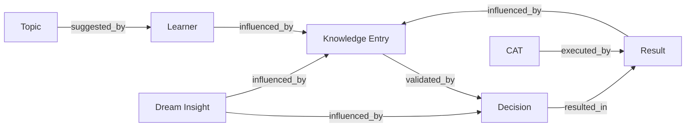

# RocketGPT Cognitive Memory Graph

**Document ID:** CM-32  
**Status:** Production Architecture Specification  
**Owner:** RocketGPT Architecture  
**Last Updated:** 2026-03-06

## 1. Graph Purpose

RocketGPT requires a connected memory graph so intelligence can be reasoned over as relationships, not isolated records. Standalone records lose causality across suggestions, execution, decisions, results, and dream insights.

The graph model is required to:

- preserve end-to-end lineage across Cognitive Mesh events;
- enable cross-entity reasoning and pattern discovery;
- support explainable impact tracing (who/what caused outcomes);
- improve retrieval and enrichment by traversing relationship context.

## 2. Graph Nodes

### Topic

Represents review or operational focus areas entering the mesh.

### Learner

Represents learner entities producing suggestions and adaptations.

### CAT

Represents CATS execution entities/plans/runs linked to actions.

### Decision

Represents consortium or governance decision artifacts.

### Result

Represents execution outcomes and measured impact records.

### Dream Insight

Represents Dream Engine-generated hypotheses and synthesized insights.

### Knowledge Entry

Represents reusable knowledge artifacts (SIL/IKL/EKL-linked entries).

## 3. Graph Edges

Canonical edge types:

- `suggested_by` (knowledge/topic/action -> learner)
- `executed_by` (action/plan -> CAT)
- `validated_by` (decision/knowledge/result -> governance or consortium decision node)
- `resulted_in` (action/decision/suggestion -> result)
- `influenced_by` (decision/result/knowledge -> dream insight, prior knowledge, or topic)

Edge rules:

- all edges must be timestamped and lineage-linked;
- cross-tenant edges are disallowed unless explicitly policy-authorized;
- edge writes must pass Zero-Trust validation and governance checks.

## 4. Graph Queries

### Find decisions that improved outcomes

Traverse: `Decision -> resulted_in -> Result` with positive outcome delta filters.

### Find learners linked to successful actions

Traverse: `Learner <- suggested_by - Action -> executed_by -> CAT -> resulted_in -> Result` with success constraints.

### Find creative ideas that later succeeded

Traverse: `Dream Insight/Knowledge Entry -> influenced_by -> Decision/Action -> resulted_in -> Result` with time-windowed success checks.

Query requirements:

- all queries must support evidence back-links and explainable traversal paths;
- query outputs must be scope-filtered by tenant/session and governance policy.

## 5. Graph Integration

### Pattern Discovery

Graph traversal exposes recurring successful structures across topics, learners, decisions, and results.

### Dream Engine

Dream Engine uses graph neighborhoods to synthesize new associations, candidate hypotheses, and exploration paths.

### Reasoning Enrichment

Reasoning systems consume graph-derived context to prioritize high-probability actions and avoid repeated failure chains.

## Architecture Diagram

## Enforcement Statement

The Cognitive Memory Graph is the authoritative relationship layer for Memory Fabric intelligence lineage. Node and edge operations must remain Zero-Trust validated, governance-controlled, and auditable.
