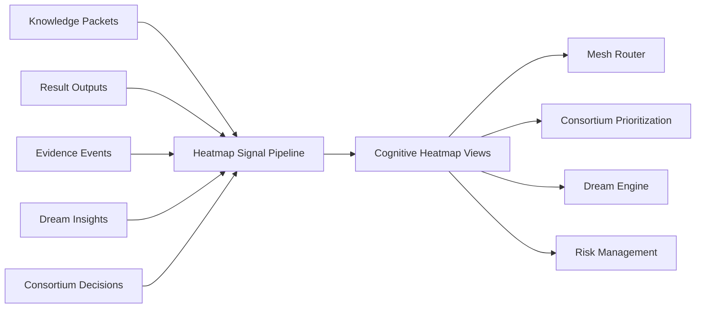

# RocketGPT Cognitive Heatmap System

**Document ID:** CM-33  
**Status:** Production Architecture Specification  
**Owner:** RocketGPT Architecture  
**Last Updated:** 2026-03-06

## 1. Purpose

The Cognitive Heatmap System is the visualization and analytics subsystem for intelligence activity across the Cognitive Mesh.

It is required to:

- visualize intelligence activity in near real time;
- detect emerging topics and acceleration zones;
- identify high-impact learners and contribution clusters;
- detect risk concentrations and failure hotspots;
- guide consortium attention toward high-value or high-risk review targets.

## 2. Heatmap Dimensions

The heatmap represents activity across:

- topics
- learners
- CATS workflows
- decisions
- results
- dream insights

Each dimension is sliceable by tenant, time window, and governance scope.

## 3. Heatmap Metrics

Measurable signals:

- `topic_activity` (volume + growth trend)
- `execution_success_rate`
- `creative_idea_generation`
- `dream_insights_frequency`
- `risk_flags`
- `governance_interventions`

Metric requirements:

- metrics must be lineage-linked and replay-consistent;
- metric windows must support short, medium, and long horizon analysis.

## 4. Heatmap Data Sources

Heatmap signals originate from:

- Knowledge Packets
- Result Outputs
- Evidence Events
- Dream Insights
- Consortium Decisions

All source ingestion must pass Zero-Trust validation and policy scope checks before aggregation.

## 5. Heatmap Views

### Topic Heatmap

Shows activity intensity, trend velocity, and decision density by topic.

### Learner Heatmap

Shows learner contribution impact, outcome quality, and risk signal concentration.

### Execution Heatmap

Shows CATS workflow throughput, success/failure ratios, and latency/risk hotspots.

### Risk Heatmap

Shows clustered risk flags, governance escalations, and unresolved anomaly regions.

### Creative Activity Heatmap

Shows creative idea and dream insight generation, validation progression, and rejection/promotions.

## 6. Alerting

The heatmap must detect and alert on:

- sudden surge in risky ideas;
- repeated execution failures;
- governance escalation spikes.

Alert behavior:

- threshold- and trend-based triggers;
- severity classification (`info`, `warning`, `critical`);
- trace-linked alert payloads for investigation and replay.

## 7. Anomaly-to-Risk Handoff Contract

Handoff rules:

- Cognitive Heatmap detects anomalies and concentration patterns.
- Risk Management evaluates whether a detected anomaly constitutes a classified risk event.
- Heatmap does not directly classify final risk severity without Risk Management evaluation.

## 8. Integration

### Mesh Router

Heatmap trends provide topic pressure and risk signals for route shaping and prioritization.

### Consortium Prioritization

Heatmap hotspots guide which topics should be reviewed first by the consortium.

### Dream Engine

Heatmap activity patterns help seed dream-cycle focus areas and simulation priorities.

### Risk Management

Heatmap anomaly zones feed governance and incident workflows for mitigation and control actions.

## Architecture Diagram

## Enforcement Statement

The Cognitive Heatmap System is an analytics and prioritization subsystem only. It must remain evidence-driven, governance-scoped, and auditable, and it must not directly mutate ratings, EKL state, or governance decisions.

## Related Specifications

- [CM-34 Risk Management and Mitigation Framework](./CM-34-risk-management-framework.md)
- [CM-37 Cognitive Stability System](./CM-37-cognitive-stability-system.md)
- [CM-40 Cognitive Life Cycle Management](./CM-40-cognitive-life-cycle-management.md)
