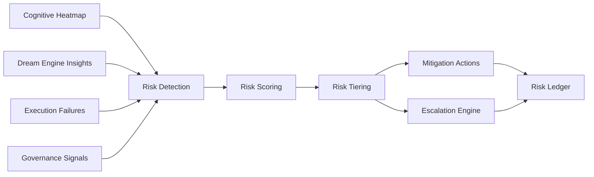

# RocketGPT Risk Management and Mitigation Framework

**Document ID:** CM-34  
**Status:** Production Architecture Specification  
**Owner:** RocketGPT Architecture  
**Last Updated:** 2026-03-06

## 1. Purpose

Risk management is required because RocketGPT is a creative cognitive system that can generate high-value innovations and high-impact failure modes in the same operating envelope. Without explicit controls, speculative reasoning, autonomous adaptation, and execution pathways can create operational, governance, and security exposure.

This framework provides:

- consistent risk identification across cognitive and execution layers;
- measurable risk scoring for prioritization and control;
- policy-bound mitigation and escalation workflows;
- auditable accountability through a dedicated Risk Ledger.

## 2. Risk Categories

### Operational Risk

Risks to reliability, latency, throughput, and service stability.

### Governance Risk

Risks of policy non-compliance, unauthorized promotion, or control bypass.

### Security Risk

Risks related to identity compromise, integrity failure, unauthorized access, or replay/tamper behavior.

### Knowledge Risk

Risks from incorrect, stale, contradictory, or low-evidence knowledge artifacts.

### Execution Risk

Risks caused by unsafe or mis-scoped action execution in CATS workflows.

### Creative Risk

Risks from speculative outputs (dream/creative hypotheses) that may be novel but unsafe or unverified.

## 3. Risk Scoring

Risk scoring uses four dimensions:

- `impact`: expected consequence severity if risk materializes;
- `likelihood`: estimated probability of occurrence;
- `governance_sensitivity`: policy/compliance criticality of affected scope;
- `system_exposure`: breadth of affected tenants, workflows, and dependencies.

Scoring rules:

- each dimension is normalized to a policy-defined scale;
- composite risk score is computed with versioned weighting;
- high governance sensitivity can elevate risk tier even when likelihood is moderate.

## 4. Risk Detection Sources

Risk detection signals originate from:

- Cognitive Heatmap;
- Dream Engine insights;
- execution failures;
- governance signals.

Detection requirements:

- all signals must be lineage-linked and scope-validated;
- cross-source correlation is required for high/critical classification.

Anomaly-to-risk handoff rules:

- Cognitive Heatmap detects anomalies and concentration patterns.
- Risk Management evaluates whether a detected anomaly constitutes a classified risk event.
- Heatmap does not directly classify final risk severity without Risk Management evaluation.

Neutral external actor classification rule:

- external actors, systems, or non-users must not be classified as hostile or adversarial by default;
- default classification is `neutral` unless explicit evidence, governance determination, or policy rules justify higher-risk classification.

Operational effects:

- risk classification starts from neutral baseline for external actors;
- lifecycle-affecting risk actions require evidence-backed escalation path;
- context-aware reasoning must avoid speculative hostility assumptions.

## 5. Risk Mitigation Actions

Primary mitigation actions:

- quarantine ideas;
- require consortium review;
- limit execution permissions;
- increase governance scrutiny.

Action rules:

- mitigation must be proportional to risk tier;
- critical-path safety controls take priority over optimization goals;
- mitigations must emit traceable reason-coded events.

## 6. Risk Escalation

Risk levels:

- low
- moderate
- high
- critical

Escalation rules:

- **low:** monitor and trend; no immediate hard control required.
- **moderate:** apply bounded mitigation and schedule consortium/governance review.
- **high:** enforce immediate control actions (permission limits/quarantine) and trigger expedited review.
- **critical:** enforce emergency containment, block unsafe pathways, and trigger governance incident protocol.

Additional escalation controls:

- repeated moderate risks in same domain may auto-escalate to high;
- unresolved high risk past SLA window auto-escalates to critical review path.

## 7. Risk Ledger

All identified risks must be recorded in an immutable Risk Ledger for audit and replay analysis.

Ledger requirements:

- append-only risk events with timestamps and actor/system identity;
- risk category, score components, tier, and mitigation actions captured;
- escalation history and resolution status linked to lineage IDs;
- retention and access governed by policy and compliance class.

### Canonical Risk Ledger Schema (JSON)

```json
{
  "risk_event_id": "risk_0001",
  "entity_type": "learner | agent | CATS | router | policy | memory",
  "entity_id": "string",
  "risk_category": "operational | governance | security | knowledge | execution | creative",
  "risk_score": 0.0,
  "impact": 0.0,
  "likelihood": 0.0,
  "detected_by": "heatmap | governance | stability | external_signal",
  "mitigation_action": "monitor | quarantine | throttle | escalate | restrict",
  "status": "open | mitigated | escalated | closed",
  "timestamp": "utc",
  "schema_version": "1.0"
}
```

Schema and audit contract:

- `schema_version` is mandatory and follows semantic compatibility policy;
- risk entries must be immutable or strictly versioned;
- all risk ledger writes must remain auditable and lineage-linked.

## 8. Operational SLO Targets

- risk detection latency target: <= 10 seconds from source signal ingestion;
- risk classification latency target: <= 30 seconds from detection;
- escalation initiation latency target: <= 15 seconds after high/critical classification.

## Architecture Diagram



## Enforcement Statement

No risk event is considered managed unless it is scored, mitigated or escalated by policy, and recorded in the Risk Ledger with auditable lineage.

## Related Specifications

- [CM-33 Cognitive Heatmap System](./CM-33-cognitive-heatmap-system.md)
- [CM-37 Cognitive Stability System](./CM-37-cognitive-stability-system.md)
- [CM-38 Repair Agents and Recovery Clinics](./CM-38-repair-agents-and-recovery-clinics.md)
- [CM-40 Cognitive Life Cycle Management](./CM-40-cognitive-life-cycle-management.md)
