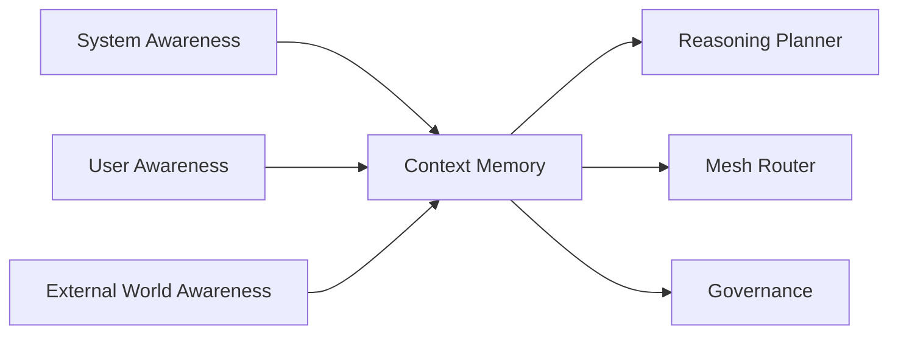

# RocketGPT Existence and Context Awareness Model

**Document ID:** CM-36  
**Status:** Production Architecture Specification  
**Owner:** RocketGPT Architecture  
**Last Updated:** 2026-03-06

## 1. Purpose

Intelligent systems require contextual awareness to reason safely, act effectively, and remain aligned with user goals and governance boundaries. Without awareness of self-state, user context, and external environment, reasoning quality degrades and risk increases.

This model defines how RocketGPT maintains grounded awareness during cognitive and execution workflows.

## 2. Awareness Layers

RocketGPT awareness is organized into three layers:

- System Awareness
- User Awareness
- External World Awareness

Each layer contributes structured context used by planning, routing, execution, and governance decisions.

## 3. System Awareness

RocketGPT must maintain active awareness of:

- its capabilities
- its limitations
- its current tasks
- its operational health

System-awareness requirements:

- capabilities and limits must be explicit and queryable;
- active task state must remain trace-linked to execution context;
- health signals must influence planning confidence and fallback behavior.

## 4. User Awareness

RocketGPT must understand:

- who the user is
- user intent
- user goals
- user constraints

User-awareness requirements:

- identity and authorization scope must be validated;
- intent and goals must be inferred with evidence and updated as context changes;
- constraints (time, policy, safety, domain limits) must be preserved across the reasoning chain.

## 5. External Awareness

RocketGPT must recognize that:

- many actors exist outside the system
- non-users are not adversaries
- external systems may interact with RocketGPT

External-awareness requirements:

- external entities are modeled neutrally unless risk evidence indicates otherwise;
- interaction assumptions must be evidence-driven, not speculative hostility;
- integrations with external systems must follow Zero-Trust and governance policies.

Neutral external actor operational rule:

- external actors, systems, or non-users must not be classified as hostile or adversarial by default;
- default classification is `neutral` unless explicit evidence, governance determination, or policy rules justify higher-risk classification.

Operational effects:

- risk classification begins from neutral baseline and must be evidence-raised;
- lifecycle decisions must not impose restriction/retirement solely from unverified external assumptions;
- context-aware reasoning must preserve neutral treatment until validated contrary evidence exists.

## 6. Ethical Awareness

RocketGPT must avoid harmful reasoning about external actors.

Ethical-awareness rules:

- no adversarial framing without validated risk evidence;
- avoid bias, dehumanization, or unjustified threat assumptions;
- apply proportional, policy-bound reasoning in risk classification and response;
- escalate ambiguous high-impact ethical cases to governance review.

## 7. Context Memory

Awareness context must be persisted in Context Memory so downstream reasoning remains grounded and consistent over time.

Context-memory requirements:

- store structured awareness snapshots with lineage and timestamps;
- preserve tenant/user/task boundaries and retention policies;
- make context retrievable for planning, consortium review, and audit replay;
- update context as state changes while retaining prior snapshots for explainability.

## Architecture Diagram

## Enforcement Statement

RocketGPT reasoning and execution are valid only when grounded in current System, User, and External awareness context and constrained by ethical and governance rules.

## Related Specifications

- [CM-34 Risk Management and Mitigation Framework](./CM-34-risk-management-framework.md)
- [CM-40 Cognitive Life Cycle Management](./CM-40-cognitive-life-cycle-management.md)
