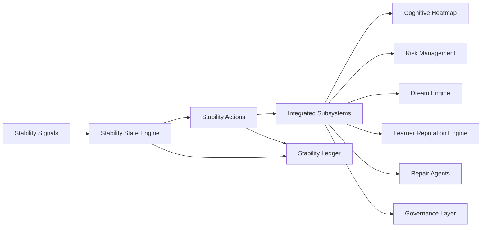

# RocketGPT Cognitive Stability System

**Document ID:** CM-37  
**Status:** Production Architecture Specification  
**Owner:** RocketGPT Architecture  
**Last Updated:** 2026-03-06

## 1. Purpose

A governed intelligence system requires a dedicated stability layer to keep adaptation safe, bounded, and recoverable under changing conditions. The Cognitive Stability System prevents local instability from propagating into system-wide degradation.

The stability layer must prevent:

- runaway creativity
- reasoning loops
- degraded learners
- unstable routing
- repeated failed execution
- governance overload
- systemic collapse after major changes

## 2. Stability Domains

### Learner Stability

Tracks learner quality drift, volatility, and persistent underperformance.

### Agent Stability

Tracks expert/agent behavioral consistency, loop tendencies, and policy adherence.

### CATS Stability

Tracks CATS execution reliability, rollback pressure, and workflow health.

### Routing Stability

Tracks route oscillation, failover churn, and queue instability.

### Memory Stability

Tracks contradiction density, stale pattern accumulation, and memory coherence.

### Governance Stability

Tracks policy gate pressure, rejection surges, and control-path saturation.

### Consortium Stability

Tracks deadlock frequency, escalation pressure, and decision throughput health.

## 3. Stability Signals

Required measurable signals:

- repeated failure rate
- contradiction rate
- degraded success rate
- governance rejection surge
- risk escalation frequency
- execution rollback frequency
- stale reasoning patterns
- instability clusters from Cognitive Heatmap

Signal rules:

- all signals must be lineage-linked and time-windowed;
- signal thresholds are domain-specific and policy-versioned;
- correlated multi-domain spikes increase instability severity tier.

## 4. Stability States

State model:

- healthy
- watch
- degraded
- critical
- isolated

Transition rules:

- `healthy -> watch`: early warning threshold exceeded in one or more domains.
- `watch -> degraded`: sustained threshold breach or multi-signal correlation.
- `degraded -> critical`: high-severity breach, repeated rollback, or governance overload.
- `critical -> isolated`: containment required to prevent propagation.
- recovery transitions require verified stabilization over policy-defined windows.

## 5. Stability Actions

The system applies one or more actions by state and domain:

- monitor
- throttle
- quarantine
- reroute
- repair
- rehabilitate
- upgrade
- escalate

Action behavior:

- `monitor`: enhanced telemetry and trend verification.
- `throttle`: reduce unstable throughput and adaptation velocity.
- `quarantine`: isolate unsafe learners/agents/memory branches.
- `reroute`: shift traffic away from unstable paths.
- `repair`: invoke corrective workflows and replay-safe fixes.
- `rehabilitate`: controlled re-entry with stricter gates.
- `upgrade`: apply vetted corrective package or policy update.
- `escalate`: trigger consortium/governance/risk incident path.

## 6. Integration

### Cognitive Heatmap

Provides instability clusters, trend acceleration, and hotspot localization.

### Risk Management Framework

Consumes and contributes risk-tier signals for mitigation and escalation alignment.

### Dream Engine

Receives stability constraints; dream outputs are throttled/quarantined during unstable states.

### Learner Reputation Engine

Uses stability signals to apply trust/rating caution bands and candidate gating.

### Repair Agents

Execute bounded remediation plans for degraded and critical states.

### Governance Layer

Authoritative controller for high-impact containment, escalation, and re-entry approval.

## Controller Precedence Matrix

| Condition | Primary Controller | Secondary Controller |
|---|---|---|
| Risk detected | Risk Management | Cognitive Stability |
| System degradation detected | Cognitive Stability | Repair Agents / Recovery Clinics |
| Component failure | Repair Agents / Recovery Clinics | Cognitive Stability |
| Policy violation | Governance | Risk Management |
| Entity lifecycle transition | Cognitive Life Cycle Management | Cognitive Stability |

Precedence contract:

- Risk Management classifies and mitigates risk.
- Cognitive Stability detects degradation and instability.
- Repair Agents / Recovery Clinics perform repair and recovery.
- Cognitive Life Cycle Management governs entity-state transitions.
- Governance remains authoritative for policy violations and rule enforcement.

## Trigger Ownership and Handoff Contract

Ownership rules:

- Cognitive Stability detects degradation or instability.
- Repair Agents / Recovery Clinics execute diagnosis, repair, retraining, or replacement.
- Cognitive Life Cycle Management updates lifecycle state transitions such as `degraded`, `under_repair`, `rehabilitated`, `restricted`, `retired`.

Handoff flow:

`stability detection -> repair trigger -> repair execution -> validation -> lifecycle state update -> monitored reintegration`

## 7. Stability Ledger

All major stability events must be logged in an immutable Stability Ledger for audit and learning.

Ledger requirements:

- record state transitions, triggers, and applied actions;
- include actor/system identity, timestamps, and reason codes;
- preserve lineage links to signals, packets, decisions, and outcomes;
- support deterministic replay for post-incident analysis and policy tuning.

### Canonical Stability Ledger Schema (JSON)

```json
{
  "stability_event_id": "stab_001",
  "entity_type": "learner | agent | CATS | router | memory_pattern",
  "entity_id": "string",
  "stability_state": "healthy | watch | degraded | critical | isolated",
  "trigger_signal": "failure_rate | contradiction_burst | rollback_spike | stale_pattern | instability_cluster",
  "detected_by": "stability_monitor",
  "action_taken": "monitor | throttle | isolate | repair | escalate",
  "timestamp": "utc",
  "schema_version": "1.0"
}
```

Event contract:

- stability events must be immutable or strictly versioned;
- `schema_version` is mandatory for compatibility management;
- relevant records must link to Risk Ledger and Lifecycle Ledger event references.

## 8. Stability and Recovery SLO Targets

- anomaly detection latency: < 10 seconds;
- component isolation latency: < 5 seconds;
- repair initiation latency: < 30 seconds;
- recovery time objective: < 5 minutes for recoverable classes.

## Architecture Diagram



## Enforcement Statement

No sustained instability condition is considered resolved until state recovery is verified by policy, integrated controls are reconciled, and all major events are recorded in the Stability Ledger.

## Related Specifications

- [CM-34 Risk Management and Mitigation Framework](./CM-34-risk-management-framework.md)
- [CM-38 Repair Agents and Recovery Clinics](./CM-38-repair-agents-and-recovery-clinics.md)
- [CM-39 Adaptive Upgrade and Rehabilitation Framework](./CM-39-adaptive-upgrade-and-rehabilitation.md)
- [CM-40 Cognitive Life Cycle Management](./CM-40-cognitive-life-cycle-management.md)
