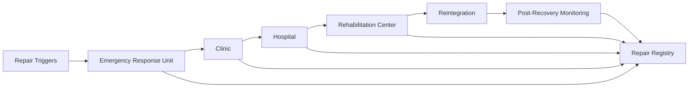

# RocketGPT Repair Agents and Recovery Clinics

**Document ID:** CM-38  
**Status:** Production Architecture Specification  
**Owner:** RocketGPT Architecture  
**Last Updated:** 2026-03-06

## 1. Purpose

RocketGPT requires a dedicated repair ecosystem to prevent persistent degradation, cascading instability, and systemic collapse. Repair Agents and Recovery Clinics provide controlled diagnosis, intervention, and recovery pathways for degraded intelligence and execution components.

The repair ecosystem ensures:

- rapid containment of unstable components;
- structured remediation proportional to issue severity;
- governed recovery with auditable validation and monitored re-entry.

## 2. Repair Scope

Repair entities include:

- learners
- reasoning agents
- consortium support agents
- CATS workflows
- routing components
- memory indexes
- governance adapters

Scope rule:

- repair actions are entity-specific but coordinated through shared safety and governance controls.

## 3. Repair Layers

### Emergency Response Unit

Immediate stabilization layer for active incidents and critical degradation.

- purpose: stop propagation and preserve safety;
- actions: isolate, throttle, reroute, emergency containment.

### Clinic

Minor diagnosis and corrective fix layer.

- purpose: resolve localized defects with minimal disruption;
- actions: targeted patching, parameter correction, limited replay validation.

### Hospital

Deep repair and major intervention layer.

- purpose: address severe or structural failures;
- actions: full subsystem repair, replacement, deep forensic analysis, controlled rollback.

### Rehabilitation Center

Retraining and monitored re-entry layer.

- purpose: recondition repaired entities before full production return;
- actions: retraining, sandbox trials, graduated traffic exposure, stability observation.

## 4. Repair Agent Roles

### Diagnostic Agent

Performs fault isolation, root-cause analysis, and severity classification.

### Patch Agent

Applies approved corrective patches and configuration updates.

### Retraining Agent

Rebuilds degraded behavior models or strategies from validated evidence.

### Validation Agent

Executes independent post-repair verification against quality and policy criteria.

### Reintegration Agent

Controls staged production re-entry and post-repair monitoring.

## 5. Repair Triggers

Repair may be triggered by:

- repeated failures
- degraded Learner Rating
- failed CAT execution chains
- governance rejection spikes
- routing instability
- contradiction bursts
- risk management escalation
- major consortium policy update

Trigger rule:

- high/critical triggers can force immediate Emergency Response Unit activation.

## 6. Repair Workflow

Canonical workflow:

`detect issue -> isolate component if needed -> diagnose cause -> choose repair path -> patch / retrain / replace -> validate -> reintegrate -> monitor post-recovery`

Workflow controls:

- every transition requires identity, timestamp, and reason code;
- severity determines layer selection (Clinic/Hospital/Rehabilitation);
- unresolved validation automatically returns entity to isolation or deeper repair layer.

Trigger ownership and handoff contract:

- Cognitive Stability detects degradation or instability.
- Repair Agents / Recovery Clinics execute diagnosis, repair, retraining, or replacement.
- Cognitive Life Cycle Management updates lifecycle state transitions such as `degraded`, `under_repair`, `rehabilitated`, `restricted`, `retired`.

Handoff flow:

`stability detection -> repair trigger -> repair execution -> validation -> lifecycle state update -> monitored reintegration`

## 7. Repair Safety Rules

- repair actions must not bypass governance;
- repair agents must not self-certify recovery;
- all repaired entities require independent validation before reintegration.

Additional constraints:

- repair actions must preserve lineage and auditability;
- emergency actions are temporary unless governance-approved as permanent changes.

## 8. Repair Registry

A Repair Registry must maintain, at minimum:

- repaired entity
- issue type
- repair method
- validation result
- post-repair monitoring period

Registry requirements:

- append-only records for each repair cycle;
- linkage to triggering signals, risk events, and governance decisions;
- retention aligned with audit and incident forensics policy.

### Canonical Repair Registry Schema (JSON)

```json
{
  "repair_id": "rep_123",
  "entity_type": "learner | agent | CATS | routing_component | memory_index",
  "entity_id": "string",
  "issue_type": "performance_degradation | policy_misalignment | execution_failure | contradiction_instability",
  "repair_method": "patch | retraining | replacement | rollback | rehabilitation",
  "validation_status": "pending | passed | failed",
  "rehabilitation_state": "diagnosed | under_treatment | validating | probation | reintegrated | failed",
  "post_repair_monitoring_period": "72h",
  "repair_timestamp": "utc",
  "schema_version": "1.0"
}
```

Schema and validation contract:

- `schema_version` is mandatory and must follow compatibility policy;
- no repaired entity may self-certify recovery;
- validation must be external to repair execution.

## Architecture Diagram



## Enforcement Statement

No repaired entity is considered production-ready until independent validation passes, governance constraints are satisfied, and recovery evidence is recorded in the Repair Registry.

## Related Specifications

- [CM-37 Cognitive Stability System](./CM-37-cognitive-stability-system.md)
- [CM-39 Adaptive Upgrade and Rehabilitation Framework](./CM-39-adaptive-upgrade-and-rehabilitation.md)
- [CM-40 Cognitive Life Cycle Management](./CM-40-cognitive-life-cycle-management.md)
