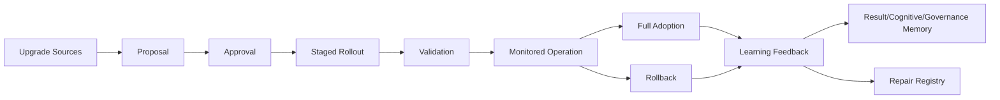

# RocketGPT Adaptive Upgrade and Rehabilitation Framework

**Document ID:** CM-39  
**Status:** Production Architecture Specification  
**Owner:** RocketGPT Architecture  
**Last Updated:** 2026-03-06

## 1. Purpose

RocketGPT requires structured upgrade and rehabilitation to prevent unsafe drift, regression, and governance violations caused by ad hoc changes. Controlled pathways ensure that improvements are validated, reversible, and auditable before full production adoption.

## 2. Upgrade Sources

Upgrades may originate from:

- consortium decisions
- governance rule changes
- result-based memory
- dream insights validated by review
- repeated CATS performance evidence
- stability system recommendations

All upgrade proposals must include lineage and evidence references.

## 3. Upgrade Targets

Upgrade and rehabilitation targets:

- learners
- reasoning agents
- CATS
- routing policies
- memory retrieval strategies
- governance adapters

## 4. Rehabilitation Types

- skill rehabilitation
- policy rehabilitation
- routing rehabilitation
- execution rehabilitation
- Learner Reputation Rehabilitation

Type selection is determined by root-cause diagnosis, risk class, and governance policy.

Terminology mapping note:

- Learner Rating is the external evidence-driven score.
- Learner Reputation is the aggregated historical profile.
- "Trust" must not be used as a synonym unless explicitly mapped to Learner Reputation.

## 5. Upgrade Lifecycle

Canonical lifecycle:

`proposal -> approval -> staged rollout -> validation -> monitored operation -> full adoption or rollback`

Lifecycle rules:

- approval requires governance-aligned evidence and scope authorization;
- staged rollout is mandatory for non-trivial changes;
- validation must be independent and policy-bound;
- rollback remains available until full adoption criteria are met.

## 6. Safe Reintegration

Rehabilitated components re-enter through controlled gates:

- probation period
- restricted scope
- increased monitoring
- outcome-based validation

Reintegration controls:

- no unrestricted re-entry before probation completion;
- repeated regressions during probation trigger rollback or deeper repair;
- critical components require explicit governance re-entry approval.

## 7. Versioning and Compatibility

Every rehabilitation or upgrade must maintain:

- version history
- compatibility record
- rollback path

Versioning requirements:

- each release artifact has immutable version identifiers;
- compatibility matrix captures upstream/downstream dependencies;
- rollback artifacts must be tested and immediately deployable.

## 8. Upgrade and Reintegration SLO Targets

- validation gate completion target: <= 10 minutes for standard upgrade classes;
- rollback trigger latency: <= 30 seconds after rollback condition match;
- rollback completion target: <= 3 minutes for reversible rollout classes;
- probation monitoring window: minimum 72 hours before unrestricted adoption.

## 9. Learning Feedback

Rehabilitation outcomes must feed back into:

- Result-Based Memory
- Cognitive Memory
- Governance Memory
- Repair Registry

Feedback rules:

- all outcomes (success, partial, failure) are recorded with evidence;
- feedback updates future upgrade prioritization and stability policy thresholds.

## Architecture Diagram

## Enforcement Statement

No upgrade or rehabilitation is production-authoritative without governed approval, validated compatibility, monitored reintegration, and auditable feedback registration.

## Related Specifications

- [CM-38 Repair Agents and Recovery Clinics](./CM-38-repair-agents-and-recovery-clinics.md)
- [CM-40 Cognitive Life Cycle Management](./CM-40-cognitive-life-cycle-management.md)
