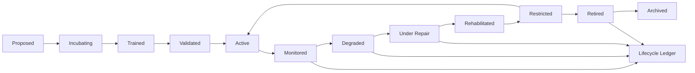

# RocketGPT Cognitive Life Cycle Management

**Document ID:** CM-40  
**Status:** Production Architecture Specification  
**Owner:** RocketGPT Architecture  
**Last Updated:** 2026-03-06

## 1. Purpose

RocketGPT must operate as a continuously renewing cognitive ecosystem, not a static intelligence system. Lifecycle governance is required to keep intelligence aligned, current, safe, and resilient under changing evidence, policy, and environment conditions.

The lifecycle system must prevent:

- staleness
- existential drift
- outdated assumptions
- degraded intelligence
- stale creativity
- governance blindness
- long-term system brittleness

## 2. Managed Entity Types

Lifecycle management applies to:

- learners
- reasoning agents
- consortium support agents
- CATS workflows
- repair agents
- memory patterns
- routing policies
- governance adapters

## 3. Lifecycle Stages

Canonical states:

`proposed -> incubating -> trained -> validated -> active -> monitored -> degraded -> under_repair -> rehabilitated -> restricted -> retired -> archived`

Usage model:

- not all entity types require every stage;
- stage subsets are policy-defined per entity class;
- transitions require identity, reason code, and governance scope checks.

## 4. Entry and Incubation

New entities are introduced with explicit controls:

- source of creation
- scope of operation
- probationary period
- validation requirements
- risk classification
- monitoring requirements

Entry rules:

- no entity may skip validation gates into active duty;
- probation scope must be bounded by tenant/workflow/policy constraints.

## 5. Active Duty and Monitoring

Active entities must be continuously monitored for:

- performance
- governance compliance
- relevance
- stability
- compatibility
- external fitness

Monitoring behavior:

- thresholds are entity-specific and policy-versioned;
- sustained adverse trends trigger degradation workflows.

## 6. Degradation Detection

Degradation signals include:

- declining outcomes
- contradiction bursts
- repeated governance rejection
- lower relevance
- stale behavior patterns
- increased repair events
- rising instability

Detection rules:

- multi-signal correlation raises severity;
- high/critical degradation can force immediate restriction or isolation.

## 7. Repair and Rehabilitation

Degraded entities move through repair, rehabilitation, validation, and controlled re-entry.

Process alignment:

- stability classification and action selection from CM-37;
- repair layer execution and registry requirements from CM-38;
- upgrade/reintegration lifecycle and rollback controls from CM-39.

References:

- [CM-37 Cognitive Stability System](./CM-37-cognitive-stability-system.md)
- [CM-38 Repair Agents and Recovery Clinics](./CM-38-repair-agents-and-recovery-clinics.md)
- [CM-39 Adaptive Upgrade and Rehabilitation Framework](./CM-39-adaptive-upgrade-and-rehabilitation.md)

## 8. Retirement and Archival

Entities are retired when no longer fit, relevant, or policy-eligible for active use.

Retirement and archival rules:

- retirement must preserve final state rationale and lineage references;
- archived entities remain queryable for audit, replay, and future learning;
- reactivation requires explicit revalidation and governance approval.

## 9. Lineage and Succession

The lifecycle system tracks:

- which entity replaced another
- version evolution
- rehabilitation lineage
- superseded policies or workflows
- inherited knowledge paths

Lineage requirements:

- succession links must be immutable and timestamped;
- inheritance paths must preserve evidence and compatibility context.

## 10. Existential Awareness Checkpoints

Periodic checkpoints must evaluate:

- whether assumptions remain valid
- whether objectives are still aligned
- whether external conditions have shifted
- whether the system is becoming closed-loop or stale
- whether non-users or external actors are being treated neutrally and correctly rather than as automatic threats

Checkpoint outcomes must drive lifecycle actions (continue, restrict, rehabilitate, retire).

## 11. Context and Ethical Awareness

Lifecycle governance enforces ongoing awareness that:

- the system must remain aware of its own existence, limits, and current health
- the system must remain aware of the user's existence, intent, and goals
- the system must recognize that many actors outside the platform exist and are not enemies by default

These requirements are mandatory for safe reasoning, renewal, and external interaction posture.

## 12. Lifecycle Ledger

All major lifecycle transitions must be recorded in an auditable Lifecycle Ledger.

Ledger requirements:

- append-only transition records;
- entity ID, prior/new state, actor/system identity, reason code, timestamp;
- lineage links to risk, repair, governance, and outcome artifacts;
- retention and replay support for audits and long-horizon learning.

## 13. Lifecycle Ledger Event Taxonomy

Lifecycle event classes:

- `entity_created`
- `entity_validated`
- `entity_activated`
- `entity_monitored`
- `entity_degraded`
- `entity_under_repair`
- `entity_rehabilitated`
- `entity_restricted`
- `entity_retired`
- `entity_archived`
- `entity_reactivated`
- `entity_superseded`

Canonical Lifecycle Ledger schema:

```json
{
  "lifecycle_event_id": "life_223",
  "entity_type": "learner | agent | CATS | repair_agent | policy_adapter | memory_pattern",
  "entity_id": "string",
  "previous_state": "active",
  "new_state": "under_repair",
  "trigger_source": "risk | stability | governance | repair_validation | lifecycle_policy",
  "decision_reference": "optional_id",
  "timestamp": "utc",
  "schema_version": "1.0"
}
```

### Mandatory Transition Baselines

| Entity Type | Mandatory Transition Baseline |
|---|---|
| learners | `proposed -> incubating -> trained -> validated -> active -> monitored`; degradation path must include `degraded -> under_repair -> rehabilitated/restricted`; retirement path must include `retired -> archived` |
| reasoning agents | `proposed -> incubating -> validated -> active -> monitored`; degradation path must include `degraded -> under_repair`; reintegration path must include `rehabilitated -> restricted/active` |
| CATS workflows | `proposed -> incubating -> validated -> active -> monitored`; failure path must include `degraded -> under_repair -> validated`; terminal path must include `retired -> archived` |

## 14. Cross-Document Alignment

This lifecycle framework is aligned with and depends on the following Cognitive Mesh specifications:

- [CM-33 Cognitive Heatmap System](./CM-33-cognitive-heatmap-system.md)  
  Provides instability, activity, and concentration signals used in lifecycle monitoring and degradation detection.
- [CM-34 Risk Management and Mitigation Framework](./CM-34-risk-management-framework.md)  
  Provides risk classification, mitigation, and escalation pathways tied to lifecycle state transitions.
- [CM-35 Creative Project Management Framework](./CM-35-creative-project-management.md)  
  Provides governed creative exploration pathways that feed entity incubation, validation, and retirement decisions.
- [CM-36 Existence and Context Awareness Model](./CM-36-existence-context-awareness.md)  
  Provides existential, user, and external-awareness checkpoints required for lifecycle alignment and anti-drift controls.
- [CM-37 Cognitive Stability System](./CM-37-cognitive-stability-system.md)  
  Provides stability states, signals, and corrective action triggers used in degradation and restriction decisions.
- [CM-38 Repair Agents and Recovery Clinics](./CM-38-repair-agents-and-recovery-clinics.md)  
  Provides layered repair execution model for `under_repair` and `rehabilitated` lifecycle stages.
- [CM-39 Adaptive Upgrade and Rehabilitation Framework](./CM-39-adaptive-upgrade-and-rehabilitation.md)  
  Provides controlled upgrade, validation, rollback, and safe reintegration contracts for lifecycle renewal.

## Architecture Diagram



## Enforcement Statement

No cognitive entity may remain in active duty without lifecycle-state validity, ongoing monitoring, existential/context awareness checks, and auditable transition lineage.

## Related Specifications

- [CM-33 Cognitive Heatmap System](./CM-33-cognitive-heatmap-system.md)
- [CM-34 Risk Management and Mitigation Framework](./CM-34-risk-management-framework.md)
- [CM-35 Creative Project Management Framework](./CM-35-creative-project-management.md)
- [CM-36 Existence and Context Awareness Model](./CM-36-existence-context-awareness.md)
- [CM-37 Cognitive Stability System](./CM-37-cognitive-stability-system.md)
- [CM-38 Repair Agents and Recovery Clinics](./CM-38-repair-agents-and-recovery-clinics.md)
- [CM-39 Adaptive Upgrade and Rehabilitation Framework](./CM-39-adaptive-upgrade-and-rehabilitation.md)
