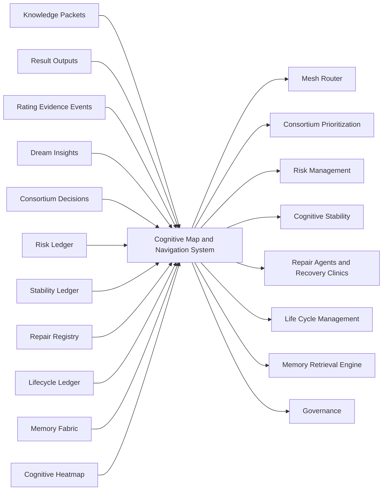

# RocketGPT Cognitive Map and Navigation System

**Document ID:** CM-41  
**Status:** Production Architecture Specification  
**Owner:** RocketGPT Architecture  
**Last Updated:** 2026-03-06

## 1. Purpose

RocketGPT requires a navigation-oriented cognitive map to convert distributed intelligence signals into actionable spatial awareness across the Cognitive Mesh. Logs, ledgers, and memory stores are necessary but insufficient for coordinated prioritization and intervention planning.

The Cognitive Map and Navigation System is required to answer:

- where intelligence activity is concentrated
- where risk is accumulating
- where creativity is emerging
- where degradation is forming
- where outcomes are strongest
- where intervention is needed next

This subsystem acts as the navigation cortex for reasoning, routing, consortium focus, repair planning, and lifecycle decisions.

## 2. Core Navigation Domains

The map organizes intelligence across these domains:

- Topic Domain
- Learner Domain
- CATS Domain
- Decision Domain
- Result Domain
- Dream Insight Domain
- Risk Domain
- Stability Domain
- Lifecycle Domain

## 3. Map Inputs

Map construction ingests and correlates:

- Knowledge Packets
- Result Outputs
- Rating Evidence Events
- Dream Insights
- Consortium Decisions
- Risk Ledger
- Stability Ledger
- Repair Registry
- Lifecycle Ledger
- Memory Fabric
- Cognitive Heatmap

Input rules:

- all sources must be lineage-linked and scope-validated;
- ingestion must enforce Zero-Trust and policy boundaries.

## 4. Map Layers

Conceptual layers:

- Activity Layer
- Risk Layer
- Outcome Layer
- Creativity Layer
- Stability Layer
- Lifecycle Layer
- Relationship Layer

Layer behavior:

- each layer is queryable independently and in cross-layer joins;
- cross-layer overlays drive prioritization and intervention recommendations.

## 5. Navigation Functions

Core functions:

- locate high-value intelligence zones
- locate high-risk clusters
- locate degraded entities
- locate successful reasoning patterns
- locate reusable outcomes
- locate dormant but promising creative ideas
- locate entities needing repair or retirement

## 6. Navigation Queries

Example queries:

- Which learners are most strongly linked to repeated successful outcomes?
- Which topics have high creative activity but also high governance risk?
- Which CATS workflows are producing degraded results and require repair?
- Which dream insights are closest to becoming validated projects?
- Which lifecycle clusters are at risk of stagnation?

Query contract:

- query results must include evidence lineage and confidence metadata;
- cross-tenant data joins are disallowed unless explicitly policy-authorized.

## 7. Navigation Priority Rules

Attention prioritization is computed from weighted factors:

- risk severity
- outcome value
- governance importance
- degradation severity
- strategic relevance
- user alignment

Priority behavior:

- high-risk/high-impact intersections are escalated first;
- user-aligned high-value opportunities are surfaced when risk posture is acceptable;
- policy-critical items can preempt purely performance-driven opportunities.

## 8. Integration with Existing Systems

### Mesh Router

Consumes map hotspots for route shaping and capacity-aware prioritization.

### Consortium Prioritization

Uses map clusters to select high-value/high-risk review queues.

### Dream Engine

Uses map gaps and emergent creativity zones to target dream-cycle focus.

### Risk Management

Uses map risk clustering to accelerate classification and escalation sequencing.

### Cognitive Stability

Uses degradation geographies and instability propagation paths for containment planning.

### Repair Agents / Recovery Clinics

Uses localized failure and dependency maps to choose repair paths and order of intervention.

### Life Cycle Management

Uses lifecycle concentration maps to trigger revalidation, restriction, retirement, or reactivation decisions.

### Memory Retrieval Engine

Uses navigational relevance context to improve retrieval targeting and enrichment precision.

## 9. Safety and Governance

Safety rules:

- navigation does not override governance;
- navigation surfaces intelligence, risk, and opportunity;
- navigation recommendations remain subject to Zero-Trust validation and policy controls.

Control rules:

- no navigation output can directly mutate ratings, EKL state, or governance decisions;
- all recommendation paths must remain auditable and explainable.

## 10. Metrics

Required metrics:

- `navigation_query_latency`
- `hotspot_detection_rate`
- `intervention_recommendation_accuracy`
- `degradation_localization_accuracy`
- `creativity_to_project_conversion_visibility`

Metric requirements:

- metrics must be segmentable by tenant/domain/time horizon;
- metrics must be lineage-correlated for replay and audit.

## 11. Architecture Diagram

## 12. Related Specifications

- [CM-28 Memory Fabric Architecture](./CM-28-memory-fabric-architecture.md)
- [CM-30 Memory Retrieval Engine](./CM-30-memory-retrieval-engine.md)
- [CM-32 Cognitive Memory Graph](./CM-32-cognitive-memory-graph.md)
- [CM-33 Cognitive Heatmap System](./CM-33-cognitive-heatmap-system.md)
- [CM-34 Risk Management and Mitigation Framework](./CM-34-risk-management-framework.md)
- [CM-37 Cognitive Stability System](./CM-37-cognitive-stability-system.md)
- [CM-38 Repair Agents and Recovery Clinics](./CM-38-repair-agents-and-recovery-clinics.md)
- [CM-40 Cognitive Life Cycle Management](./CM-40-cognitive-life-cycle-management.md)

## Enforcement Statement

The Cognitive Map and Navigation System is an intelligence navigation layer only. It must remain governed, Zero-Trust constrained, and auditable, and it may recommend but not directly enforce policy or state mutation actions.
